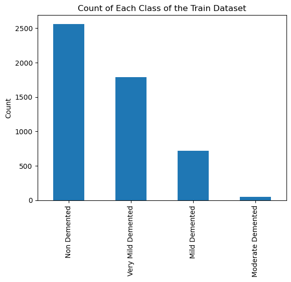
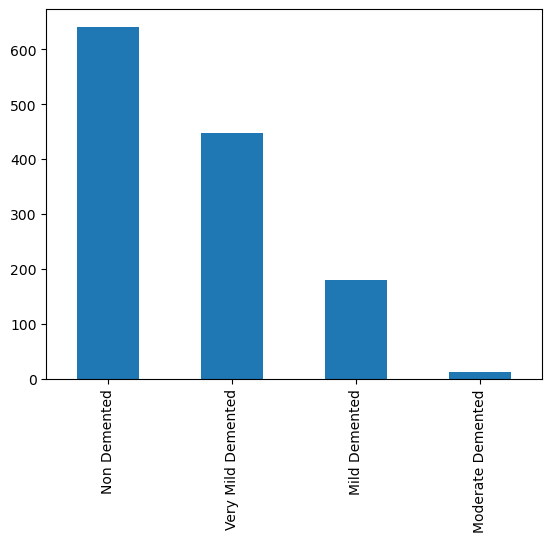
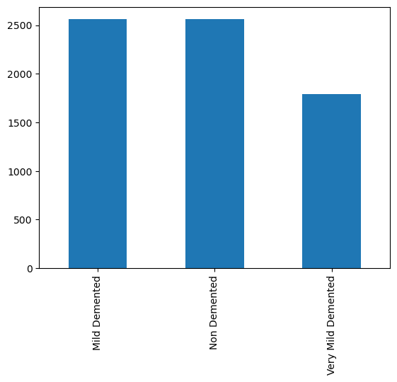
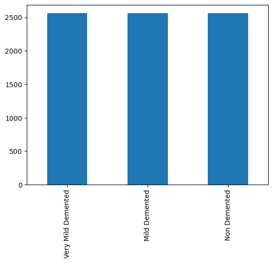
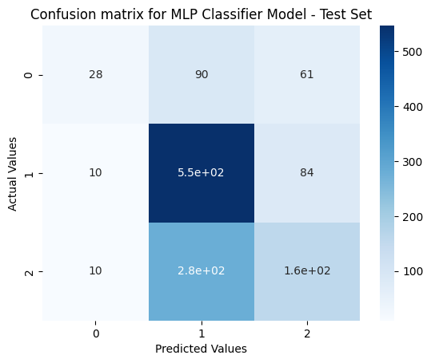
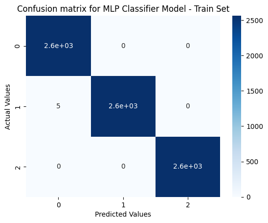
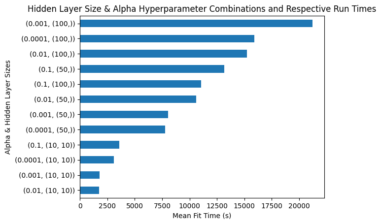
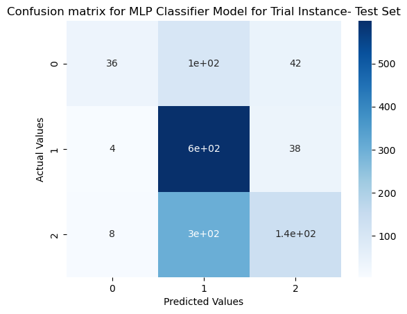

# Alzheimer's Classification using MRI Images with Neural Network Models

# Introduction

## Initial Motivations for Project

Throughout this project, I will be developing a machine learning model to learn a new task. I will be using the Scikit-learn Module to initialize, train, and test the accuracy of my machine learning module. Scikit-learn is an extremely popular package for various machine learning modules and contains lots of documentation. 

In my undergraduate study, I completed an Honors Project focusing on Neural Network Machine Learning (ML) arlgorithsm and their applications in the healthcare industry. I examined the inner workings of an ML Diagnostic Model using statistics and philosophy of logic material to explain the "black box" problem. The "black box" describes how little computational scientists understand about how an ML model conceptualizes their tasks and how they "arrive" at conclusions. Having approached ML models from this perspective, I wanted to see if I could utilize a computational approach and actually build my own ML model. I decided to focus specifically on Neural Networks since they were the main topic of my undergraduate project and since they have proven to be very successful in clinical diagnostic contexts. 

## Alzheimers Dataset

The dataset for this ML project was taken from Kaggle, a common repository for ML Model Datasets. This dataset came from the following link: https://www.kaggle.com/datasets/tourist55/alzheimers-dataset-4-class-of-images

This dataset contains MRI JPG Images of Alzheimer patients. They are grouped into the following categories:

1. Mild Demented
2. Moderate Demented
3. Non Demented
4. Very Mild Demented

JPG files were all 208 x 196 pixels in lenth and dataset has already been split into test and train datasets. 

## Objective

The objective of this machine learning project is to classify the severity of Alzhiemers into 4 categories (including a Non Demented class)

## Developing the Neural Network

### Importing Modules


```python
import pandas as pd
import numpy as np
import matplotlib.pyplot as plt
import seaborn as sns
%matplotlib inline
import os
import sklearn.datasets as skl_data
from PIL import Image

from sklearn.neural_network import MLPClassifier 
from sklearn.metrics import confusion_matrix, classification_report, accuracy_score
from sklearn.model_selection import GridSearchCV


```

### Processing Images

#### Function for Converting Train Dataset JPGs into Pixel Data

Each image is 208x176 pixels and the number of files for each category in the train and test dataset are below. Therefore, there will be 36608 pixels of data. There are 5121 jpg files total in the train dataset. 

I will use these facts to initialize a 2 dimensional array (5121 x 36608)


```python
def JPG2Pixel_Training_Data(directory):
    train_complete_array = np.zeros((5121,36608))
    i = 0
    for root, dirs, files in os.walk(directory):
        for filename in files:
            if filename.endswith('.jpg'):
                train_file_path = os.path.join(root, filename)
                train_pixelated_image = Image.open(train_file_path)
                train_numpy_array = np.asarray(train_pixelated_image)
                train_reshaped_image = train_numpy_array.reshape(1, -1)
                train_complete_array[i] = train_reshaped_image
                i += 1
    return train_complete_array
```


```python
Train_Dataset = "/Users/bigyambat/Desktop/TRGN_ML/Alzheimer_Dataset/train"

```


```python
final_train_array = JPG2Pixel_Training_Data(Train_Dataset)
```


```python
np.shape(final_train_array)
```


    (5121, 36608)


#### Function for Converting Test Datset JPG into Pixel Data

Each image is 208x176 pixels and the number of files for each category in the train and test dataset are below. Therefore, there will be 36608 pixels of data. There are 1279 jpg files in the test dataset.

I will use these facts to initialize a 2 dimensional array (1279 x 36608)


```python
def JPG2Pixel_Test_Data(directory):
    test_complete_array = np.zeros([1279,36608])
    i = 0
    for root, dirs, files in os.walk(directory):
        for filename in files:
            if filename.endswith('.jpg'):
                test_file_path = os.path.join(root, filename)
                test_pixelated_image = Image.open(test_file_path)
                test_numpy_array = np.asarray(test_pixelated_image)
                test_reshaped_image = test_numpy_array.reshape(1, -1)
                test_complete_array[i] = test_reshaped_image
                i += 1
    return test_complete_array
```


```python
Test_Dataset = "/Users/bigyambat/Desktop/TRGN_ML/Alzheimer_Dataset/test"
```


```python
final_test_array = JPG2Pixel_Test_Data(Test_Dataset)
```


```python
np.shape(final_test_array)
```


    (1279, 36608)


### Data Wrangling

#### Creating Dataframe for Train Dataset


```python
train_df = pd.DataFrame(final_train_array)
```


```python
train_df
```


<div>

</style>
<table border="1" class="dataframe">
  <thead>
    <tr style="text-align: right;">
      <th></th>
      <th>0</th>
      <th>1</th>
      <th>2</th>
      <th>3</th>
      <th>4</th>
      <th>5</th>
      <th>6</th>
      <th>7</th>
      <th>8</th>
      <th>9</th>
      <th>...</th>
      <th>36598</th>
      <th>36599</th>
      <th>36600</th>
      <th>36601</th>
      <th>36602</th>
      <th>36603</th>
      <th>36604</th>
      <th>36605</th>
      <th>36606</th>
      <th>36607</th>
    </tr>
  </thead>
  <tbody>
    <tr>
      <th>0</th>
      <td>0.0</td>
      <td>0.0</td>
      <td>0.0</td>
      <td>0.0</td>
      <td>0.0</td>
      <td>0.0</td>
      <td>0.0</td>
      <td>0.0</td>
      <td>0.0</td>
      <td>0.0</td>
      <td>...</td>
      <td>0.0</td>
      <td>0.0</td>
      <td>0.0</td>
      <td>0.0</td>
      <td>0.0</td>
      <td>0.0</td>
      <td>0.0</td>
      <td>0.0</td>
      <td>0.0</td>
      <td>0.0</td>
    </tr>
    <tr>
      <th>1</th>
      <td>0.0</td>
      <td>0.0</td>
      <td>0.0</td>
      <td>0.0</td>
      <td>0.0</td>
      <td>0.0</td>
      <td>0.0</td>
      <td>0.0</td>
      <td>0.0</td>
      <td>0.0</td>
      <td>...</td>
      <td>0.0</td>
      <td>0.0</td>
      <td>0.0</td>
      <td>0.0</td>
      <td>0.0</td>
      <td>0.0</td>
      <td>0.0</td>
      <td>0.0</td>
      <td>0.0</td>
      <td>0.0</td>
    </tr>
    <tr>
      <th>2</th>
      <td>0.0</td>
      <td>0.0</td>
      <td>0.0</td>
      <td>0.0</td>
      <td>0.0</td>
      <td>0.0</td>
      <td>0.0</td>
      <td>0.0</td>
      <td>0.0</td>
      <td>0.0</td>
      <td>...</td>
      <td>0.0</td>
      <td>0.0</td>
      <td>0.0</td>
      <td>0.0</td>
      <td>0.0</td>
      <td>0.0</td>
      <td>0.0</td>
      <td>0.0</td>
      <td>0.0</td>
      <td>0.0</td>
    </tr>
    <tr>
      <th>3</th>
      <td>0.0</td>
      <td>0.0</td>
      <td>0.0</td>
      <td>0.0</td>
      <td>0.0</td>
      <td>0.0</td>
      <td>0.0</td>
      <td>0.0</td>
      <td>0.0</td>
      <td>0.0</td>
      <td>...</td>
      <td>0.0</td>
      <td>0.0</td>
      <td>0.0</td>
      <td>0.0</td>
      <td>0.0</td>
      <td>0.0</td>
      <td>0.0</td>
      <td>0.0</td>
      <td>0.0</td>
      <td>0.0</td>
    </tr>
    <tr>
      <th>4</th>
      <td>0.0</td>
      <td>0.0</td>
      <td>0.0</td>
      <td>0.0</td>
      <td>0.0</td>
      <td>0.0</td>
      <td>0.0</td>
      <td>0.0</td>
      <td>0.0</td>
      <td>0.0</td>
      <td>...</td>
      <td>0.0</td>
      <td>0.0</td>
      <td>0.0</td>
      <td>0.0</td>
      <td>0.0</td>
      <td>0.0</td>
      <td>0.0</td>
      <td>0.0</td>
      <td>0.0</td>
      <td>0.0</td>
    </tr>
    <tr>
      <th>...</th>
      <td>...</td>
      <td>...</td>
      <td>...</td>
      <td>...</td>
      <td>...</td>
      <td>...</td>
      <td>...</td>
      <td>...</td>
      <td>...</td>
      <td>...</td>
      <td>...</td>
      <td>...</td>
      <td>...</td>
      <td>...</td>
      <td>...</td>
      <td>...</td>
      <td>...</td>
      <td>...</td>
      <td>...</td>
      <td>...</td>
      <td>...</td>
    </tr>
    <tr>
      <th>5116</th>
      <td>0.0</td>
      <td>0.0</td>
      <td>0.0</td>
      <td>0.0</td>
      <td>0.0</td>
      <td>0.0</td>
      <td>0.0</td>
      <td>0.0</td>
      <td>0.0</td>
      <td>0.0</td>
      <td>...</td>
      <td>0.0</td>
      <td>0.0</td>
      <td>0.0</td>
      <td>0.0</td>
      <td>0.0</td>
      <td>0.0</td>
      <td>0.0</td>
      <td>0.0</td>
      <td>0.0</td>
      <td>0.0</td>
    </tr>
    <tr>
      <th>5117</th>
      <td>0.0</td>
      <td>0.0</td>
      <td>0.0</td>
      <td>0.0</td>
      <td>0.0</td>
      <td>0.0</td>
      <td>0.0</td>
      <td>0.0</td>
      <td>0.0</td>
      <td>0.0</td>
      <td>...</td>
      <td>0.0</td>
      <td>0.0</td>
      <td>0.0</td>
      <td>0.0</td>
      <td>0.0</td>
      <td>0.0</td>
      <td>0.0</td>
      <td>0.0</td>
      <td>0.0</td>
      <td>0.0</td>
    </tr>
    <tr>
      <th>5118</th>
      <td>0.0</td>
      <td>0.0</td>
      <td>0.0</td>
      <td>0.0</td>
      <td>0.0</td>
      <td>0.0</td>
      <td>0.0</td>
      <td>0.0</td>
      <td>0.0</td>
      <td>0.0</td>
      <td>...</td>
      <td>0.0</td>
      <td>0.0</td>
      <td>0.0</td>
      <td>0.0</td>
      <td>0.0</td>
      <td>0.0</td>
      <td>0.0</td>
      <td>0.0</td>
      <td>0.0</td>
      <td>0.0</td>
    </tr>
    <tr>
      <th>5119</th>
      <td>0.0</td>
      <td>0.0</td>
      <td>0.0</td>
      <td>0.0</td>
      <td>0.0</td>
      <td>0.0</td>
      <td>0.0</td>
      <td>0.0</td>
      <td>0.0</td>
      <td>0.0</td>
      <td>...</td>
      <td>0.0</td>
      <td>0.0</td>
      <td>0.0</td>
      <td>0.0</td>
      <td>0.0</td>
      <td>0.0</td>
      <td>0.0</td>
      <td>0.0</td>
      <td>0.0</td>
      <td>0.0</td>
    </tr>
    <tr>
      <th>5120</th>
      <td>0.0</td>
      <td>0.0</td>
      <td>0.0</td>
      <td>0.0</td>
      <td>0.0</td>
      <td>0.0</td>
      <td>0.0</td>
      <td>0.0</td>
      <td>0.0</td>
      <td>0.0</td>
      <td>...</td>
      <td>0.0</td>
      <td>0.0</td>
      <td>0.0</td>
      <td>0.0</td>
      <td>0.0</td>
      <td>0.0</td>
      <td>0.0</td>
      <td>0.0</td>
      <td>0.0</td>
      <td>0.0</td>
    </tr>
  </tbody>
</table>
<p>5121 rows × 36608 columns</p>
</div>


```python
train_df.max(axis='columns')
```


    0       255.0
    1       255.0
    2       255.0
    3       255.0
    4       255.0
            ...  
    5116    252.0
    5117    255.0
    5118    255.0
    5119    255.0
    5120    255.0
    Length: 5121, dtype: float64


```python
train_df.max(axis='columns').max()
```


    255.0


Based on the value above, the train dataset has a maximum pixel value of 255. 

#### Creating Dataframe for Test Dataset


```python
test_df = pd.DataFrame(final_test_array)
```


```python
test_df
```


<div>
<style scoped>
    .dataframe tbody tr th:only-of-type {
        vertical-align: middle;
    }

    .dataframe tbody tr th {
        vertical-align: top;
    }

    .dataframe thead th {
        text-align: right;
    }
</style>
<table border="1" class="dataframe">
  <thead>
    <tr style="text-align: right;">
      <th></th>
      <th>0</th>
      <th>1</th>
      <th>2</th>
      <th>3</th>
      <th>4</th>
      <th>5</th>
      <th>6</th>
      <th>7</th>
      <th>8</th>
      <th>9</th>
      <th>...</th>
      <th>36598</th>
      <th>36599</th>
      <th>36600</th>
      <th>36601</th>
      <th>36602</th>
      <th>36603</th>
      <th>36604</th>
      <th>36605</th>
      <th>36606</th>
      <th>36607</th>
    </tr>
  </thead>
  <tbody>
    <tr>
      <th>0</th>
      <td>0.0</td>
      <td>0.0</td>
      <td>0.0</td>
      <td>0.0</td>
      <td>0.0</td>
      <td>0.0</td>
      <td>0.0</td>
      <td>0.0</td>
      <td>0.0</td>
      <td>0.0</td>
      <td>...</td>
      <td>0.0</td>
      <td>0.0</td>
      <td>0.0</td>
      <td>0.0</td>
      <td>0.0</td>
      <td>0.0</td>
      <td>0.0</td>
      <td>0.0</td>
      <td>0.0</td>
      <td>0.0</td>
    </tr>
    <tr>
      <th>1</th>
      <td>0.0</td>
      <td>0.0</td>
      <td>0.0</td>
      <td>0.0</td>
      <td>0.0</td>
      <td>0.0</td>
      <td>0.0</td>
      <td>0.0</td>
      <td>0.0</td>
      <td>0.0</td>
      <td>...</td>
      <td>0.0</td>
      <td>0.0</td>
      <td>0.0</td>
      <td>0.0</td>
      <td>0.0</td>
      <td>0.0</td>
      <td>0.0</td>
      <td>0.0</td>
      <td>0.0</td>
      <td>0.0</td>
    </tr>
    <tr>
      <th>2</th>
      <td>0.0</td>
      <td>0.0</td>
      <td>0.0</td>
      <td>0.0</td>
      <td>0.0</td>
      <td>0.0</td>
      <td>0.0</td>
      <td>0.0</td>
      <td>0.0</td>
      <td>0.0</td>
      <td>...</td>
      <td>0.0</td>
      <td>0.0</td>
      <td>0.0</td>
      <td>0.0</td>
      <td>0.0</td>
      <td>0.0</td>
      <td>0.0</td>
      <td>0.0</td>
      <td>0.0</td>
      <td>0.0</td>
    </tr>
    <tr>
      <th>3</th>
      <td>0.0</td>
      <td>0.0</td>
      <td>0.0</td>
      <td>0.0</td>
      <td>0.0</td>
      <td>0.0</td>
      <td>0.0</td>
      <td>0.0</td>
      <td>0.0</td>
      <td>0.0</td>
      <td>...</td>
      <td>0.0</td>
      <td>0.0</td>
      <td>0.0</td>
      <td>0.0</td>
      <td>0.0</td>
      <td>0.0</td>
      <td>0.0</td>
      <td>0.0</td>
      <td>0.0</td>
      <td>0.0</td>
    </tr>
    <tr>
      <th>4</th>
      <td>0.0</td>
      <td>0.0</td>
      <td>0.0</td>
      <td>0.0</td>
      <td>0.0</td>
      <td>0.0</td>
      <td>0.0</td>
      <td>0.0</td>
      <td>0.0</td>
      <td>0.0</td>
      <td>...</td>
      <td>0.0</td>
      <td>0.0</td>
      <td>0.0</td>
      <td>0.0</td>
      <td>0.0</td>
      <td>0.0</td>
      <td>0.0</td>
      <td>0.0</td>
      <td>0.0</td>
      <td>0.0</td>
    </tr>
    <tr>
      <th>...</th>
      <td>...</td>
      <td>...</td>
      <td>...</td>
      <td>...</td>
      <td>...</td>
      <td>...</td>
      <td>...</td>
      <td>...</td>
      <td>...</td>
      <td>...</td>
      <td>...</td>
      <td>...</td>
      <td>...</td>
      <td>...</td>
      <td>...</td>
      <td>...</td>
      <td>...</td>
      <td>...</td>
      <td>...</td>
      <td>...</td>
      <td>...</td>
    </tr>
    <tr>
      <th>1274</th>
      <td>0.0</td>
      <td>0.0</td>
      <td>0.0</td>
      <td>0.0</td>
      <td>0.0</td>
      <td>0.0</td>
      <td>0.0</td>
      <td>0.0</td>
      <td>0.0</td>
      <td>0.0</td>
      <td>...</td>
      <td>0.0</td>
      <td>0.0</td>
      <td>0.0</td>
      <td>0.0</td>
      <td>0.0</td>
      <td>0.0</td>
      <td>0.0</td>
      <td>0.0</td>
      <td>0.0</td>
      <td>0.0</td>
    </tr>
    <tr>
      <th>1275</th>
      <td>0.0</td>
      <td>0.0</td>
      <td>0.0</td>
      <td>0.0</td>
      <td>0.0</td>
      <td>0.0</td>
      <td>0.0</td>
      <td>0.0</td>
      <td>0.0</td>
      <td>0.0</td>
      <td>...</td>
      <td>0.0</td>
      <td>0.0</td>
      <td>0.0</td>
      <td>0.0</td>
      <td>0.0</td>
      <td>0.0</td>
      <td>0.0</td>
      <td>0.0</td>
      <td>0.0</td>
      <td>0.0</td>
    </tr>
    <tr>
      <th>1276</th>
      <td>0.0</td>
      <td>0.0</td>
      <td>0.0</td>
      <td>0.0</td>
      <td>0.0</td>
      <td>0.0</td>
      <td>0.0</td>
      <td>0.0</td>
      <td>0.0</td>
      <td>0.0</td>
      <td>...</td>
      <td>0.0</td>
      <td>0.0</td>
      <td>0.0</td>
      <td>0.0</td>
      <td>0.0</td>
      <td>0.0</td>
      <td>0.0</td>
      <td>0.0</td>
      <td>0.0</td>
      <td>0.0</td>
    </tr>
    <tr>
      <th>1277</th>
      <td>0.0</td>
      <td>0.0</td>
      <td>0.0</td>
      <td>0.0</td>
      <td>0.0</td>
      <td>0.0</td>
      <td>0.0</td>
      <td>0.0</td>
      <td>0.0</td>
      <td>0.0</td>
      <td>...</td>
      <td>0.0</td>
      <td>0.0</td>
      <td>0.0</td>
      <td>0.0</td>
      <td>0.0</td>
      <td>0.0</td>
      <td>0.0</td>
      <td>0.0</td>
      <td>0.0</td>
      <td>0.0</td>
    </tr>
    <tr>
      <th>1278</th>
      <td>0.0</td>
      <td>0.0</td>
      <td>0.0</td>
      <td>0.0</td>
      <td>0.0</td>
      <td>0.0</td>
      <td>0.0</td>
      <td>0.0</td>
      <td>0.0</td>
      <td>0.0</td>
      <td>...</td>
      <td>0.0</td>
      <td>0.0</td>
      <td>0.0</td>
      <td>0.0</td>
      <td>0.0</td>
      <td>0.0</td>
      <td>0.0</td>
      <td>0.0</td>
      <td>0.0</td>
      <td>0.0</td>
    </tr>
  </tbody>
</table>
<p>1279 rows × 36608 columns</p>
</div>


```python
test_df.max(axis ='columns')
```


    0       252.0
    1       255.0
    2       255.0
    3       255.0
    4       255.0
            ...  
    1274    253.0
    1275    251.0
    1276    254.0
    1277    255.0
    1278    248.0
    Length: 1279, dtype: float64


```python
test_df.max(axis ='columns').max()
```


    255.0


Based on the value above, the test dataset has a maximum pixel value of 255. 

### Adding Labels to Data

The JPG2Pixel functions above iterated through the test and the train class folders in the following order

1. Very Mild Demebted
2. Moderate Demented
3. Mild Demented
4. Non Demented

Based on these classes (and the number of files for each class), I am able to deduce the labels for each row of the train_df and test_df

#### Train Dataframe


```python
train_df['Labels']= 'Classes'
```


```python
train_df.loc[0:1791,'Labels'] = 'Very Mild Demented'
train_df.loc[1791:1843,'Labels'] = 'Moderate Demented'
train_df.loc[1843:2560,'Labels'] = 'Mild Demented'
train_df.loc[2560:5120,'Labels'] = 'Non Demented'

```


```python
train_df
```


<div>
<style scoped>
    .dataframe tbody tr th:only-of-type {
        vertical-align: middle;
    }

    .dataframe tbody tr th {
        vertical-align: top;
    }

    .dataframe thead th {
        text-align: right;
    }
</style>
<table border="1" class="dataframe">
  <thead>
    <tr style="text-align: right;">
      <th></th>
      <th>0</th>
      <th>1</th>
      <th>2</th>
      <th>3</th>
      <th>4</th>
      <th>5</th>
      <th>6</th>
      <th>7</th>
      <th>8</th>
      <th>9</th>
      <th>...</th>
      <th>36599</th>
      <th>36600</th>
      <th>36601</th>
      <th>36602</th>
      <th>36603</th>
      <th>36604</th>
      <th>36605</th>
      <th>36606</th>
      <th>36607</th>
      <th>Labels</th>
    </tr>
  </thead>
  <tbody>
    <tr>
      <th>0</th>
      <td>0.0</td>
      <td>0.0</td>
      <td>0.0</td>
      <td>0.0</td>
      <td>0.0</td>
      <td>0.0</td>
      <td>0.0</td>
      <td>0.0</td>
      <td>0.0</td>
      <td>0.0</td>
      <td>...</td>
      <td>0.0</td>
      <td>0.0</td>
      <td>0.0</td>
      <td>0.0</td>
      <td>0.0</td>
      <td>0.0</td>
      <td>0.0</td>
      <td>0.0</td>
      <td>0.0</td>
      <td>Very Mild Demented</td>
    </tr>
    <tr>
      <th>1</th>
      <td>0.0</td>
      <td>0.0</td>
      <td>0.0</td>
      <td>0.0</td>
      <td>0.0</td>
      <td>0.0</td>
      <td>0.0</td>
      <td>0.0</td>
      <td>0.0</td>
      <td>0.0</td>
      <td>...</td>
      <td>0.0</td>
      <td>0.0</td>
      <td>0.0</td>
      <td>0.0</td>
      <td>0.0</td>
      <td>0.0</td>
      <td>0.0</td>
      <td>0.0</td>
      <td>0.0</td>
      <td>Very Mild Demented</td>
    </tr>
    <tr>
      <th>2</th>
      <td>0.0</td>
      <td>0.0</td>
      <td>0.0</td>
      <td>0.0</td>
      <td>0.0</td>
      <td>0.0</td>
      <td>0.0</td>
      <td>0.0</td>
      <td>0.0</td>
      <td>0.0</td>
      <td>...</td>
      <td>0.0</td>
      <td>0.0</td>
      <td>0.0</td>
      <td>0.0</td>
      <td>0.0</td>
      <td>0.0</td>
      <td>0.0</td>
      <td>0.0</td>
      <td>0.0</td>
      <td>Very Mild Demented</td>
    </tr>
    <tr>
      <th>3</th>
      <td>0.0</td>
      <td>0.0</td>
      <td>0.0</td>
      <td>0.0</td>
      <td>0.0</td>
      <td>0.0</td>
      <td>0.0</td>
      <td>0.0</td>
      <td>0.0</td>
      <td>0.0</td>
      <td>...</td>
      <td>0.0</td>
      <td>0.0</td>
      <td>0.0</td>
      <td>0.0</td>
      <td>0.0</td>
      <td>0.0</td>
      <td>0.0</td>
      <td>0.0</td>
      <td>0.0</td>
      <td>Very Mild Demented</td>
    </tr>
    <tr>
      <th>4</th>
      <td>0.0</td>
      <td>0.0</td>
      <td>0.0</td>
      <td>0.0</td>
      <td>0.0</td>
      <td>0.0</td>
      <td>0.0</td>
      <td>0.0</td>
      <td>0.0</td>
      <td>0.0</td>
      <td>...</td>
      <td>0.0</td>
      <td>0.0</td>
      <td>0.0</td>
      <td>0.0</td>
      <td>0.0</td>
      <td>0.0</td>
      <td>0.0</td>
      <td>0.0</td>
      <td>0.0</td>
      <td>Very Mild Demented</td>
    </tr>
    <tr>
      <th>...</th>
      <td>...</td>
      <td>...</td>
      <td>...</td>
      <td>...</td>
      <td>...</td>
      <td>...</td>
      <td>...</td>
      <td>...</td>
      <td>...</td>
      <td>...</td>
      <td>...</td>
      <td>...</td>
      <td>...</td>
      <td>...</td>
      <td>...</td>
      <td>...</td>
      <td>...</td>
      <td>...</td>
      <td>...</td>
      <td>...</td>
      <td>...</td>
    </tr>
    <tr>
      <th>5116</th>
      <td>0.0</td>
      <td>0.0</td>
      <td>0.0</td>
      <td>0.0</td>
      <td>0.0</td>
      <td>0.0</td>
      <td>0.0</td>
      <td>0.0</td>
      <td>0.0</td>
      <td>0.0</td>
      <td>...</td>
      <td>0.0</td>
      <td>0.0</td>
      <td>0.0</td>
      <td>0.0</td>
      <td>0.0</td>
      <td>0.0</td>
      <td>0.0</td>
      <td>0.0</td>
      <td>0.0</td>
      <td>Non Demented</td>
    </tr>
    <tr>
      <th>5117</th>
      <td>0.0</td>
      <td>0.0</td>
      <td>0.0</td>
      <td>0.0</td>
      <td>0.0</td>
      <td>0.0</td>
      <td>0.0</td>
      <td>0.0</td>
      <td>0.0</td>
      <td>0.0</td>
      <td>...</td>
      <td>0.0</td>
      <td>0.0</td>
      <td>0.0</td>
      <td>0.0</td>
      <td>0.0</td>
      <td>0.0</td>
      <td>0.0</td>
      <td>0.0</td>
      <td>0.0</td>
      <td>Non Demented</td>
    </tr>
    <tr>
      <th>5118</th>
      <td>0.0</td>
      <td>0.0</td>
      <td>0.0</td>
      <td>0.0</td>
      <td>0.0</td>
      <td>0.0</td>
      <td>0.0</td>
      <td>0.0</td>
      <td>0.0</td>
      <td>0.0</td>
      <td>...</td>
      <td>0.0</td>
      <td>0.0</td>
      <td>0.0</td>
      <td>0.0</td>
      <td>0.0</td>
      <td>0.0</td>
      <td>0.0</td>
      <td>0.0</td>
      <td>0.0</td>
      <td>Non Demented</td>
    </tr>
    <tr>
      <th>5119</th>
      <td>0.0</td>
      <td>0.0</td>
      <td>0.0</td>
      <td>0.0</td>
      <td>0.0</td>
      <td>0.0</td>
      <td>0.0</td>
      <td>0.0</td>
      <td>0.0</td>
      <td>0.0</td>
      <td>...</td>
      <td>0.0</td>
      <td>0.0</td>
      <td>0.0</td>
      <td>0.0</td>
      <td>0.0</td>
      <td>0.0</td>
      <td>0.0</td>
      <td>0.0</td>
      <td>0.0</td>
      <td>Non Demented</td>
    </tr>
    <tr>
      <th>5120</th>
      <td>0.0</td>
      <td>0.0</td>
      <td>0.0</td>
      <td>0.0</td>
      <td>0.0</td>
      <td>0.0</td>
      <td>0.0</td>
      <td>0.0</td>
      <td>0.0</td>
      <td>0.0</td>
      <td>...</td>
      <td>0.0</td>
      <td>0.0</td>
      <td>0.0</td>
      <td>0.0</td>
      <td>0.0</td>
      <td>0.0</td>
      <td>0.0</td>
      <td>0.0</td>
      <td>0.0</td>
      <td>Non Demented</td>
    </tr>
  </tbody>
</table>
<p>5121 rows × 36609 columns</p>
</div>


#### Test Dataframe


```python
test_df['Labels']= 'Classes'
```


```python
test_df.loc[0:447,'Labels'] = 'Very Mild Demented'
test_df.loc[447:459,'Labels'] = 'Moderate Demented'
test_df.loc[459:638,'Labels'] = 'Mild Demented'
test_df.loc[638:1278,'Labels'] = 'Non Demented'
```


```python
test_df
```


<div>
<style scoped>
    .dataframe tbody tr th:only-of-type {
        vertical-align: middle;
    }

    .dataframe tbody tr th {
        vertical-align: top;
    }

    .dataframe thead th {
        text-align: right;
    }
</style>
<table border="1" class="dataframe">
  <thead>
    <tr style="text-align: right;">
      <th></th>
      <th>0</th>
      <th>1</th>
      <th>2</th>
      <th>3</th>
      <th>4</th>
      <th>5</th>
      <th>6</th>
      <th>7</th>
      <th>8</th>
      <th>9</th>
      <th>...</th>
      <th>36599</th>
      <th>36600</th>
      <th>36601</th>
      <th>36602</th>
      <th>36603</th>
      <th>36604</th>
      <th>36605</th>
      <th>36606</th>
      <th>36607</th>
      <th>Labels</th>
    </tr>
  </thead>
  <tbody>
    <tr>
      <th>0</th>
      <td>0.0</td>
      <td>0.0</td>
      <td>0.0</td>
      <td>0.0</td>
      <td>0.0</td>
      <td>0.0</td>
      <td>0.0</td>
      <td>0.0</td>
      <td>0.0</td>
      <td>0.0</td>
      <td>...</td>
      <td>0.0</td>
      <td>0.0</td>
      <td>0.0</td>
      <td>0.0</td>
      <td>0.0</td>
      <td>0.0</td>
      <td>0.0</td>
      <td>0.0</td>
      <td>0.0</td>
      <td>Very Mild Demented</td>
    </tr>
    <tr>
      <th>1</th>
      <td>0.0</td>
      <td>0.0</td>
      <td>0.0</td>
      <td>0.0</td>
      <td>0.0</td>
      <td>0.0</td>
      <td>0.0</td>
      <td>0.0</td>
      <td>0.0</td>
      <td>0.0</td>
      <td>...</td>
      <td>0.0</td>
      <td>0.0</td>
      <td>0.0</td>
      <td>0.0</td>
      <td>0.0</td>
      <td>0.0</td>
      <td>0.0</td>
      <td>0.0</td>
      <td>0.0</td>
      <td>Very Mild Demented</td>
    </tr>
    <tr>
      <th>2</th>
      <td>0.0</td>
      <td>0.0</td>
      <td>0.0</td>
      <td>0.0</td>
      <td>0.0</td>
      <td>0.0</td>
      <td>0.0</td>
      <td>0.0</td>
      <td>0.0</td>
      <td>0.0</td>
      <td>...</td>
      <td>0.0</td>
      <td>0.0</td>
      <td>0.0</td>
      <td>0.0</td>
      <td>0.0</td>
      <td>0.0</td>
      <td>0.0</td>
      <td>0.0</td>
      <td>0.0</td>
      <td>Very Mild Demented</td>
    </tr>
    <tr>
      <th>3</th>
      <td>0.0</td>
      <td>0.0</td>
      <td>0.0</td>
      <td>0.0</td>
      <td>0.0</td>
      <td>0.0</td>
      <td>0.0</td>
      <td>0.0</td>
      <td>0.0</td>
      <td>0.0</td>
      <td>...</td>
      <td>0.0</td>
      <td>0.0</td>
      <td>0.0</td>
      <td>0.0</td>
      <td>0.0</td>
      <td>0.0</td>
      <td>0.0</td>
      <td>0.0</td>
      <td>0.0</td>
      <td>Very Mild Demented</td>
    </tr>
    <tr>
      <th>4</th>
      <td>0.0</td>
      <td>0.0</td>
      <td>0.0</td>
      <td>0.0</td>
      <td>0.0</td>
      <td>0.0</td>
      <td>0.0</td>
      <td>0.0</td>
      <td>0.0</td>
      <td>0.0</td>
      <td>...</td>
      <td>0.0</td>
      <td>0.0</td>
      <td>0.0</td>
      <td>0.0</td>
      <td>0.0</td>
      <td>0.0</td>
      <td>0.0</td>
      <td>0.0</td>
      <td>0.0</td>
      <td>Very Mild Demented</td>
    </tr>
    <tr>
      <th>...</th>
      <td>...</td>
      <td>...</td>
      <td>...</td>
      <td>...</td>
      <td>...</td>
      <td>...</td>
      <td>...</td>
      <td>...</td>
      <td>...</td>
      <td>...</td>
      <td>...</td>
      <td>...</td>
      <td>...</td>
      <td>...</td>
      <td>...</td>
      <td>...</td>
      <td>...</td>
      <td>...</td>
      <td>...</td>
      <td>...</td>
      <td>...</td>
    </tr>
    <tr>
      <th>1274</th>
      <td>0.0</td>
      <td>0.0</td>
      <td>0.0</td>
      <td>0.0</td>
      <td>0.0</td>
      <td>0.0</td>
      <td>0.0</td>
      <td>0.0</td>
      <td>0.0</td>
      <td>0.0</td>
      <td>...</td>
      <td>0.0</td>
      <td>0.0</td>
      <td>0.0</td>
      <td>0.0</td>
      <td>0.0</td>
      <td>0.0</td>
      <td>0.0</td>
      <td>0.0</td>
      <td>0.0</td>
      <td>Non Demented</td>
    </tr>
    <tr>
      <th>1275</th>
      <td>0.0</td>
      <td>0.0</td>
      <td>0.0</td>
      <td>0.0</td>
      <td>0.0</td>
      <td>0.0</td>
      <td>0.0</td>
      <td>0.0</td>
      <td>0.0</td>
      <td>0.0</td>
      <td>...</td>
      <td>0.0</td>
      <td>0.0</td>
      <td>0.0</td>
      <td>0.0</td>
      <td>0.0</td>
      <td>0.0</td>
      <td>0.0</td>
      <td>0.0</td>
      <td>0.0</td>
      <td>Non Demented</td>
    </tr>
    <tr>
      <th>1276</th>
      <td>0.0</td>
      <td>0.0</td>
      <td>0.0</td>
      <td>0.0</td>
      <td>0.0</td>
      <td>0.0</td>
      <td>0.0</td>
      <td>0.0</td>
      <td>0.0</td>
      <td>0.0</td>
      <td>...</td>
      <td>0.0</td>
      <td>0.0</td>
      <td>0.0</td>
      <td>0.0</td>
      <td>0.0</td>
      <td>0.0</td>
      <td>0.0</td>
      <td>0.0</td>
      <td>0.0</td>
      <td>Non Demented</td>
    </tr>
    <tr>
      <th>1277</th>
      <td>0.0</td>
      <td>0.0</td>
      <td>0.0</td>
      <td>0.0</td>
      <td>0.0</td>
      <td>0.0</td>
      <td>0.0</td>
      <td>0.0</td>
      <td>0.0</td>
      <td>0.0</td>
      <td>...</td>
      <td>0.0</td>
      <td>0.0</td>
      <td>0.0</td>
      <td>0.0</td>
      <td>0.0</td>
      <td>0.0</td>
      <td>0.0</td>
      <td>0.0</td>
      <td>0.0</td>
      <td>Non Demented</td>
    </tr>
    <tr>
      <th>1278</th>
      <td>0.0</td>
      <td>0.0</td>
      <td>0.0</td>
      <td>0.0</td>
      <td>0.0</td>
      <td>0.0</td>
      <td>0.0</td>
      <td>0.0</td>
      <td>0.0</td>
      <td>0.0</td>
      <td>...</td>
      <td>0.0</td>
      <td>0.0</td>
      <td>0.0</td>
      <td>0.0</td>
      <td>0.0</td>
      <td>0.0</td>
      <td>0.0</td>
      <td>0.0</td>
      <td>0.0</td>
      <td>Non Demented</td>
    </tr>
  </tbody>
</table>
<p>1279 rows × 36609 columns</p>
</div>


### Visualizing the Data


```python
train_df['Labels'].value_counts().plot(kind='bar', ylabel = "Count", title="Count of Each Class of the Train Dataset")

plt.show
```


    <function matplotlib.pyplot.show(close=None, block=None)>


    

    


```python
test_df['Labels'].value_counts().plot(kind='bar')
plt.show
```


    <function matplotlib.pyplot.show(close=None, block=None)>


    

    


From the figures above, its clear that both the train and test dataset are imbalanced. The moderate demented class in particular contains drastically lower samples than the other classes in the dataset. This is a common issue called imbalanced classification. Therefore, I will need to perform random oversampling to compensate for this. However, since the moderate demented class has an order of magintude lower data, oversampling this class might induce problems in the machine learning model. In general, oversampling can lead to overfitting issues in the ML model. Therefore, I will be removing the Moderate Demented class from both the training and test datasets. The model will be trained for the following 3 classes: Non Demented, Very Mild Demented, and Mild Demented. I will be oversampling the Very Mild Demented and Mild Demented classes to balance both the train and test dataset. 


```python
train_df.drop(train_df[train_df["Labels"] == 'Moderate Demented'].index, inplace=True)
train_df.Labels.unique()
train_df
```


<div>
<style scoped>
    .dataframe tbody tr th:only-of-type {
        vertical-align: middle;
    }

    .dataframe tbody tr th {
        vertical-align: top;
    }

    .dataframe thead th {
        text-align: right;
    }
</style>
<table border="1" class="dataframe">
  <thead>
    <tr style="text-align: right;">
      <th></th>
      <th>0</th>
      <th>1</th>
      <th>2</th>
      <th>3</th>
      <th>4</th>
      <th>5</th>
      <th>6</th>
      <th>7</th>
      <th>8</th>
      <th>9</th>
      <th>...</th>
      <th>36599</th>
      <th>36600</th>
      <th>36601</th>
      <th>36602</th>
      <th>36603</th>
      <th>36604</th>
      <th>36605</th>
      <th>36606</th>
      <th>36607</th>
      <th>Labels</th>
    </tr>
  </thead>
  <tbody>
    <tr>
      <th>0</th>
      <td>0.0</td>
      <td>0.0</td>
      <td>0.0</td>
      <td>0.0</td>
      <td>0.0</td>
      <td>0.0</td>
      <td>0.0</td>
      <td>0.0</td>
      <td>0.0</td>
      <td>0.0</td>
      <td>...</td>
      <td>0.0</td>
      <td>0.0</td>
      <td>0.0</td>
      <td>0.0</td>
      <td>0.0</td>
      <td>0.0</td>
      <td>0.0</td>
      <td>0.0</td>
      <td>0.0</td>
      <td>Very Mild Demented</td>
    </tr>
    <tr>
      <th>1</th>
      <td>0.0</td>
      <td>0.0</td>
      <td>0.0</td>
      <td>0.0</td>
      <td>0.0</td>
      <td>0.0</td>
      <td>0.0</td>
      <td>0.0</td>
      <td>0.0</td>
      <td>0.0</td>
      <td>...</td>
      <td>0.0</td>
      <td>0.0</td>
      <td>0.0</td>
      <td>0.0</td>
      <td>0.0</td>
      <td>0.0</td>
      <td>0.0</td>
      <td>0.0</td>
      <td>0.0</td>
      <td>Very Mild Demented</td>
    </tr>
    <tr>
      <th>2</th>
      <td>0.0</td>
      <td>0.0</td>
      <td>0.0</td>
      <td>0.0</td>
      <td>0.0</td>
      <td>0.0</td>
      <td>0.0</td>
      <td>0.0</td>
      <td>0.0</td>
      <td>0.0</td>
      <td>...</td>
      <td>0.0</td>
      <td>0.0</td>
      <td>0.0</td>
      <td>0.0</td>
      <td>0.0</td>
      <td>0.0</td>
      <td>0.0</td>
      <td>0.0</td>
      <td>0.0</td>
      <td>Very Mild Demented</td>
    </tr>
    <tr>
      <th>3</th>
      <td>0.0</td>
      <td>0.0</td>
      <td>0.0</td>
      <td>0.0</td>
      <td>0.0</td>
      <td>0.0</td>
      <td>0.0</td>
      <td>0.0</td>
      <td>0.0</td>
      <td>0.0</td>
      <td>...</td>
      <td>0.0</td>
      <td>0.0</td>
      <td>0.0</td>
      <td>0.0</td>
      <td>0.0</td>
      <td>0.0</td>
      <td>0.0</td>
      <td>0.0</td>
      <td>0.0</td>
      <td>Very Mild Demented</td>
    </tr>
    <tr>
      <th>4</th>
      <td>0.0</td>
      <td>0.0</td>
      <td>0.0</td>
      <td>0.0</td>
      <td>0.0</td>
      <td>0.0</td>
      <td>0.0</td>
      <td>0.0</td>
      <td>0.0</td>
      <td>0.0</td>
      <td>...</td>
      <td>0.0</td>
      <td>0.0</td>
      <td>0.0</td>
      <td>0.0</td>
      <td>0.0</td>
      <td>0.0</td>
      <td>0.0</td>
      <td>0.0</td>
      <td>0.0</td>
      <td>Very Mild Demented</td>
    </tr>
    <tr>
      <th>...</th>
      <td>...</td>
      <td>...</td>
      <td>...</td>
      <td>...</td>
      <td>...</td>
      <td>...</td>
      <td>...</td>
      <td>...</td>
      <td>...</td>
      <td>...</td>
      <td>...</td>
      <td>...</td>
      <td>...</td>
      <td>...</td>
      <td>...</td>
      <td>...</td>
      <td>...</td>
      <td>...</td>
      <td>...</td>
      <td>...</td>
      <td>...</td>
    </tr>
    <tr>
      <th>5116</th>
      <td>0.0</td>
      <td>0.0</td>
      <td>0.0</td>
      <td>0.0</td>
      <td>0.0</td>
      <td>0.0</td>
      <td>0.0</td>
      <td>0.0</td>
      <td>0.0</td>
      <td>0.0</td>
      <td>...</td>
      <td>0.0</td>
      <td>0.0</td>
      <td>0.0</td>
      <td>0.0</td>
      <td>0.0</td>
      <td>0.0</td>
      <td>0.0</td>
      <td>0.0</td>
      <td>0.0</td>
      <td>Non Demented</td>
    </tr>
    <tr>
      <th>5117</th>
      <td>0.0</td>
      <td>0.0</td>
      <td>0.0</td>
      <td>0.0</td>
      <td>0.0</td>
      <td>0.0</td>
      <td>0.0</td>
      <td>0.0</td>
      <td>0.0</td>
      <td>0.0</td>
      <td>...</td>
      <td>0.0</td>
      <td>0.0</td>
      <td>0.0</td>
      <td>0.0</td>
      <td>0.0</td>
      <td>0.0</td>
      <td>0.0</td>
      <td>0.0</td>
      <td>0.0</td>
      <td>Non Demented</td>
    </tr>
    <tr>
      <th>5118</th>
      <td>0.0</td>
      <td>0.0</td>
      <td>0.0</td>
      <td>0.0</td>
      <td>0.0</td>
      <td>0.0</td>
      <td>0.0</td>
      <td>0.0</td>
      <td>0.0</td>
      <td>0.0</td>
      <td>...</td>
      <td>0.0</td>
      <td>0.0</td>
      <td>0.0</td>
      <td>0.0</td>
      <td>0.0</td>
      <td>0.0</td>
      <td>0.0</td>
      <td>0.0</td>
      <td>0.0</td>
      <td>Non Demented</td>
    </tr>
    <tr>
      <th>5119</th>
      <td>0.0</td>
      <td>0.0</td>
      <td>0.0</td>
      <td>0.0</td>
      <td>0.0</td>
      <td>0.0</td>
      <td>0.0</td>
      <td>0.0</td>
      <td>0.0</td>
      <td>0.0</td>
      <td>...</td>
      <td>0.0</td>
      <td>0.0</td>
      <td>0.0</td>
      <td>0.0</td>
      <td>0.0</td>
      <td>0.0</td>
      <td>0.0</td>
      <td>0.0</td>
      <td>0.0</td>
      <td>Non Demented</td>
    </tr>
    <tr>
      <th>5120</th>
      <td>0.0</td>
      <td>0.0</td>
      <td>0.0</td>
      <td>0.0</td>
      <td>0.0</td>
      <td>0.0</td>
      <td>0.0</td>
      <td>0.0</td>
      <td>0.0</td>
      <td>0.0</td>
      <td>...</td>
      <td>0.0</td>
      <td>0.0</td>
      <td>0.0</td>
      <td>0.0</td>
      <td>0.0</td>
      <td>0.0</td>
      <td>0.0</td>
      <td>0.0</td>
      <td>0.0</td>
      <td>Non Demented</td>
    </tr>
  </tbody>
</table>
<p>5069 rows × 36609 columns</p>
</div>


```python
test_df.drop(test_df[test_df["Labels"] == 'Moderate Demented'].index, inplace=True)
test_df.Labels.unique()
test_df
```


<div>
<style scoped>
    .dataframe tbody tr th:only-of-type {
        vertical-align: middle;
    }

    .dataframe tbody tr th {
        vertical-align: top;
    }

    .dataframe thead th {
        text-align: right;
    }
</style>
<table border="1" class="dataframe">
  <thead>
    <tr style="text-align: right;">
      <th></th>
      <th>0</th>
      <th>1</th>
      <th>2</th>
      <th>3</th>
      <th>4</th>
      <th>5</th>
      <th>6</th>
      <th>7</th>
      <th>8</th>
      <th>9</th>
      <th>...</th>
      <th>36599</th>
      <th>36600</th>
      <th>36601</th>
      <th>36602</th>
      <th>36603</th>
      <th>36604</th>
      <th>36605</th>
      <th>36606</th>
      <th>36607</th>
      <th>Labels</th>
    </tr>
  </thead>
  <tbody>
    <tr>
      <th>0</th>
      <td>0.0</td>
      <td>0.0</td>
      <td>0.0</td>
      <td>0.0</td>
      <td>0.0</td>
      <td>0.0</td>
      <td>0.0</td>
      <td>0.0</td>
      <td>0.0</td>
      <td>0.0</td>
      <td>...</td>
      <td>0.0</td>
      <td>0.0</td>
      <td>0.0</td>
      <td>0.0</td>
      <td>0.0</td>
      <td>0.0</td>
      <td>0.0</td>
      <td>0.0</td>
      <td>0.0</td>
      <td>Very Mild Demented</td>
    </tr>
    <tr>
      <th>1</th>
      <td>0.0</td>
      <td>0.0</td>
      <td>0.0</td>
      <td>0.0</td>
      <td>0.0</td>
      <td>0.0</td>
      <td>0.0</td>
      <td>0.0</td>
      <td>0.0</td>
      <td>0.0</td>
      <td>...</td>
      <td>0.0</td>
      <td>0.0</td>
      <td>0.0</td>
      <td>0.0</td>
      <td>0.0</td>
      <td>0.0</td>
      <td>0.0</td>
      <td>0.0</td>
      <td>0.0</td>
      <td>Very Mild Demented</td>
    </tr>
    <tr>
      <th>2</th>
      <td>0.0</td>
      <td>0.0</td>
      <td>0.0</td>
      <td>0.0</td>
      <td>0.0</td>
      <td>0.0</td>
      <td>0.0</td>
      <td>0.0</td>
      <td>0.0</td>
      <td>0.0</td>
      <td>...</td>
      <td>0.0</td>
      <td>0.0</td>
      <td>0.0</td>
      <td>0.0</td>
      <td>0.0</td>
      <td>0.0</td>
      <td>0.0</td>
      <td>0.0</td>
      <td>0.0</td>
      <td>Very Mild Demented</td>
    </tr>
    <tr>
      <th>3</th>
      <td>0.0</td>
      <td>0.0</td>
      <td>0.0</td>
      <td>0.0</td>
      <td>0.0</td>
      <td>0.0</td>
      <td>0.0</td>
      <td>0.0</td>
      <td>0.0</td>
      <td>0.0</td>
      <td>...</td>
      <td>0.0</td>
      <td>0.0</td>
      <td>0.0</td>
      <td>0.0</td>
      <td>0.0</td>
      <td>0.0</td>
      <td>0.0</td>
      <td>0.0</td>
      <td>0.0</td>
      <td>Very Mild Demented</td>
    </tr>
    <tr>
      <th>4</th>
      <td>0.0</td>
      <td>0.0</td>
      <td>0.0</td>
      <td>0.0</td>
      <td>0.0</td>
      <td>0.0</td>
      <td>0.0</td>
      <td>0.0</td>
      <td>0.0</td>
      <td>0.0</td>
      <td>...</td>
      <td>0.0</td>
      <td>0.0</td>
      <td>0.0</td>
      <td>0.0</td>
      <td>0.0</td>
      <td>0.0</td>
      <td>0.0</td>
      <td>0.0</td>
      <td>0.0</td>
      <td>Very Mild Demented</td>
    </tr>
    <tr>
      <th>...</th>
      <td>...</td>
      <td>...</td>
      <td>...</td>
      <td>...</td>
      <td>...</td>
      <td>...</td>
      <td>...</td>
      <td>...</td>
      <td>...</td>
      <td>...</td>
      <td>...</td>
      <td>...</td>
      <td>...</td>
      <td>...</td>
      <td>...</td>
      <td>...</td>
      <td>...</td>
      <td>...</td>
      <td>...</td>
      <td>...</td>
      <td>...</td>
    </tr>
    <tr>
      <th>1274</th>
      <td>0.0</td>
      <td>0.0</td>
      <td>0.0</td>
      <td>0.0</td>
      <td>0.0</td>
      <td>0.0</td>
      <td>0.0</td>
      <td>0.0</td>
      <td>0.0</td>
      <td>0.0</td>
      <td>...</td>
      <td>0.0</td>
      <td>0.0</td>
      <td>0.0</td>
      <td>0.0</td>
      <td>0.0</td>
      <td>0.0</td>
      <td>0.0</td>
      <td>0.0</td>
      <td>0.0</td>
      <td>Non Demented</td>
    </tr>
    <tr>
      <th>1275</th>
      <td>0.0</td>
      <td>0.0</td>
      <td>0.0</td>
      <td>0.0</td>
      <td>0.0</td>
      <td>0.0</td>
      <td>0.0</td>
      <td>0.0</td>
      <td>0.0</td>
      <td>0.0</td>
      <td>...</td>
      <td>0.0</td>
      <td>0.0</td>
      <td>0.0</td>
      <td>0.0</td>
      <td>0.0</td>
      <td>0.0</td>
      <td>0.0</td>
      <td>0.0</td>
      <td>0.0</td>
      <td>Non Demented</td>
    </tr>
    <tr>
      <th>1276</th>
      <td>0.0</td>
      <td>0.0</td>
      <td>0.0</td>
      <td>0.0</td>
      <td>0.0</td>
      <td>0.0</td>
      <td>0.0</td>
      <td>0.0</td>
      <td>0.0</td>
      <td>0.0</td>
      <td>...</td>
      <td>0.0</td>
      <td>0.0</td>
      <td>0.0</td>
      <td>0.0</td>
      <td>0.0</td>
      <td>0.0</td>
      <td>0.0</td>
      <td>0.0</td>
      <td>0.0</td>
      <td>Non Demented</td>
    </tr>
    <tr>
      <th>1277</th>
      <td>0.0</td>
      <td>0.0</td>
      <td>0.0</td>
      <td>0.0</td>
      <td>0.0</td>
      <td>0.0</td>
      <td>0.0</td>
      <td>0.0</td>
      <td>0.0</td>
      <td>0.0</td>
      <td>...</td>
      <td>0.0</td>
      <td>0.0</td>
      <td>0.0</td>
      <td>0.0</td>
      <td>0.0</td>
      <td>0.0</td>
      <td>0.0</td>
      <td>0.0</td>
      <td>0.0</td>
      <td>Non Demented</td>
    </tr>
    <tr>
      <th>1278</th>
      <td>0.0</td>
      <td>0.0</td>
      <td>0.0</td>
      <td>0.0</td>
      <td>0.0</td>
      <td>0.0</td>
      <td>0.0</td>
      <td>0.0</td>
      <td>0.0</td>
      <td>0.0</td>
      <td>...</td>
      <td>0.0</td>
      <td>0.0</td>
      <td>0.0</td>
      <td>0.0</td>
      <td>0.0</td>
      <td>0.0</td>
      <td>0.0</td>
      <td>0.0</td>
      <td>0.0</td>
      <td>Non Demented</td>
    </tr>
  </tbody>
</table>
<p>1267 rows × 36609 columns</p>
</div>


Now, there are 5069 samples for the train dataset and 1267 samples for the test dataset

## Normalization

Before oversampling the data, the train and test datasets should be normalized. ML models that are based on pixel data especially is tend to be sensitive to feature scaling. Normally, any scaling method like (StandardScaler from sklearn.preprocessing) would be sufficient. However, due to the structure of the data, a simpler method can be used to scale the data. Based on the Creating Dataframe Section, the maximum pixel value both the train and test dataset is 255. So dividing all values of the dataset by 255, will normalize the data. Using this method, values will range from 0-1 for each pixel. 


```python
train_df.loc[:, 0:36607] = train_df.loc[:, 0:36607] / 255
train_df.max(axis ='columns')
```

    /var/folders/gd/2x012bcn7c3cyfr5829j_dkm0000gn/T/ipykernel_1417/2489170132.py:2: FutureWarning: Dropping of nuisance columns in DataFrame reductions (with 'numeric_only=None') is deprecated; in a future version this will raise TypeError.  Select only valid columns before calling the reduction.
      train_df.max(axis ='columns')


    0       1.000000
    1       1.000000
    2       1.000000
    3       1.000000
    4       1.000000
              ...   
    5116    0.988235
    5117    1.000000
    5118    1.000000
    5119    1.000000
    5120    1.000000
    Length: 5069, dtype: float64


```python
test_df.loc[:, 0:36607] = test_df.loc[:, 0:36607] / 255
test_df.max(axis ='columns')
```

    /var/folders/gd/2x012bcn7c3cyfr5829j_dkm0000gn/T/ipykernel_1417/1919608565.py:2: FutureWarning: Dropping of nuisance columns in DataFrame reductions (with 'numeric_only=None') is deprecated; in a future version this will raise TypeError.  Select only valid columns before calling the reduction.
      test_df.max(axis ='columns')


    0       0.988235
    1       1.000000
    2       1.000000
    3       1.000000
    4       1.000000
              ...   
    1274    0.992157
    1275    0.984314
    1276    0.996078
    1277    1.000000
    1278    0.972549
    Length: 1267, dtype: float64


## Model Selection

As mentioned, I will be using scikit-learn modules for machine learning. From here onwards, these modules will be used to oversample, initialize, run quality checks, and optimize the model. Before doing this, I will be defining variables for the model. Historically, X is the features and Y is the labels. I will do this for both the train and test datasets. The data must be formatted this in this manner to use scikit-learn modules. You also want to split the dataset before running any oversampling techniques (otherwise there will be repeat data in the test and train datasets)


```python
X_Train = train_df.drop(columns="Labels")
Y_Train = train_df.Labels
```


```python
X_Train
```


<div>
<style scoped>
    .dataframe tbody tr th:only-of-type {
        vertical-align: middle;
    }

    .dataframe tbody tr th {
        vertical-align: top;
    }

    .dataframe thead th {
        text-align: right;
    }
</style>
<table border="1" class="dataframe">
  <thead>
    <tr style="text-align: right;">
      <th></th>
      <th>0</th>
      <th>1</th>
      <th>2</th>
      <th>3</th>
      <th>4</th>
      <th>5</th>
      <th>6</th>
      <th>7</th>
      <th>8</th>
      <th>9</th>
      <th>...</th>
      <th>36598</th>
      <th>36599</th>
      <th>36600</th>
      <th>36601</th>
      <th>36602</th>
      <th>36603</th>
      <th>36604</th>
      <th>36605</th>
      <th>36606</th>
      <th>36607</th>
    </tr>
  </thead>
  <tbody>
    <tr>
      <th>0</th>
      <td>0.0</td>
      <td>0.0</td>
      <td>0.0</td>
      <td>0.0</td>
      <td>0.0</td>
      <td>0.0</td>
      <td>0.0</td>
      <td>0.0</td>
      <td>0.0</td>
      <td>0.0</td>
      <td>...</td>
      <td>0.0</td>
      <td>0.0</td>
      <td>0.0</td>
      <td>0.0</td>
      <td>0.0</td>
      <td>0.0</td>
      <td>0.0</td>
      <td>0.0</td>
      <td>0.0</td>
      <td>0.0</td>
    </tr>
    <tr>
      <th>1</th>
      <td>0.0</td>
      <td>0.0</td>
      <td>0.0</td>
      <td>0.0</td>
      <td>0.0</td>
      <td>0.0</td>
      <td>0.0</td>
      <td>0.0</td>
      <td>0.0</td>
      <td>0.0</td>
      <td>...</td>
      <td>0.0</td>
      <td>0.0</td>
      <td>0.0</td>
      <td>0.0</td>
      <td>0.0</td>
      <td>0.0</td>
      <td>0.0</td>
      <td>0.0</td>
      <td>0.0</td>
      <td>0.0</td>
    </tr>
    <tr>
      <th>2</th>
      <td>0.0</td>
      <td>0.0</td>
      <td>0.0</td>
      <td>0.0</td>
      <td>0.0</td>
      <td>0.0</td>
      <td>0.0</td>
      <td>0.0</td>
      <td>0.0</td>
      <td>0.0</td>
      <td>...</td>
      <td>0.0</td>
      <td>0.0</td>
      <td>0.0</td>
      <td>0.0</td>
      <td>0.0</td>
      <td>0.0</td>
      <td>0.0</td>
      <td>0.0</td>
      <td>0.0</td>
      <td>0.0</td>
    </tr>
    <tr>
      <th>3</th>
      <td>0.0</td>
      <td>0.0</td>
      <td>0.0</td>
      <td>0.0</td>
      <td>0.0</td>
      <td>0.0</td>
      <td>0.0</td>
      <td>0.0</td>
      <td>0.0</td>
      <td>0.0</td>
      <td>...</td>
      <td>0.0</td>
      <td>0.0</td>
      <td>0.0</td>
      <td>0.0</td>
      <td>0.0</td>
      <td>0.0</td>
      <td>0.0</td>
      <td>0.0</td>
      <td>0.0</td>
      <td>0.0</td>
    </tr>
    <tr>
      <th>4</th>
      <td>0.0</td>
      <td>0.0</td>
      <td>0.0</td>
      <td>0.0</td>
      <td>0.0</td>
      <td>0.0</td>
      <td>0.0</td>
      <td>0.0</td>
      <td>0.0</td>
      <td>0.0</td>
      <td>...</td>
      <td>0.0</td>
      <td>0.0</td>
      <td>0.0</td>
      <td>0.0</td>
      <td>0.0</td>
      <td>0.0</td>
      <td>0.0</td>
      <td>0.0</td>
      <td>0.0</td>
      <td>0.0</td>
    </tr>
    <tr>
      <th>...</th>
      <td>...</td>
      <td>...</td>
      <td>...</td>
      <td>...</td>
      <td>...</td>
      <td>...</td>
      <td>...</td>
      <td>...</td>
      <td>...</td>
      <td>...</td>
      <td>...</td>
      <td>...</td>
      <td>...</td>
      <td>...</td>
      <td>...</td>
      <td>...</td>
      <td>...</td>
      <td>...</td>
      <td>...</td>
      <td>...</td>
      <td>...</td>
    </tr>
    <tr>
      <th>5116</th>
      <td>0.0</td>
      <td>0.0</td>
      <td>0.0</td>
      <td>0.0</td>
      <td>0.0</td>
      <td>0.0</td>
      <td>0.0</td>
      <td>0.0</td>
      <td>0.0</td>
      <td>0.0</td>
      <td>...</td>
      <td>0.0</td>
      <td>0.0</td>
      <td>0.0</td>
      <td>0.0</td>
      <td>0.0</td>
      <td>0.0</td>
      <td>0.0</td>
      <td>0.0</td>
      <td>0.0</td>
      <td>0.0</td>
    </tr>
    <tr>
      <th>5117</th>
      <td>0.0</td>
      <td>0.0</td>
      <td>0.0</td>
      <td>0.0</td>
      <td>0.0</td>
      <td>0.0</td>
      <td>0.0</td>
      <td>0.0</td>
      <td>0.0</td>
      <td>0.0</td>
      <td>...</td>
      <td>0.0</td>
      <td>0.0</td>
      <td>0.0</td>
      <td>0.0</td>
      <td>0.0</td>
      <td>0.0</td>
      <td>0.0</td>
      <td>0.0</td>
      <td>0.0</td>
      <td>0.0</td>
    </tr>
    <tr>
      <th>5118</th>
      <td>0.0</td>
      <td>0.0</td>
      <td>0.0</td>
      <td>0.0</td>
      <td>0.0</td>
      <td>0.0</td>
      <td>0.0</td>
      <td>0.0</td>
      <td>0.0</td>
      <td>0.0</td>
      <td>...</td>
      <td>0.0</td>
      <td>0.0</td>
      <td>0.0</td>
      <td>0.0</td>
      <td>0.0</td>
      <td>0.0</td>
      <td>0.0</td>
      <td>0.0</td>
      <td>0.0</td>
      <td>0.0</td>
    </tr>
    <tr>
      <th>5119</th>
      <td>0.0</td>
      <td>0.0</td>
      <td>0.0</td>
      <td>0.0</td>
      <td>0.0</td>
      <td>0.0</td>
      <td>0.0</td>
      <td>0.0</td>
      <td>0.0</td>
      <td>0.0</td>
      <td>...</td>
      <td>0.0</td>
      <td>0.0</td>
      <td>0.0</td>
      <td>0.0</td>
      <td>0.0</td>
      <td>0.0</td>
      <td>0.0</td>
      <td>0.0</td>
      <td>0.0</td>
      <td>0.0</td>
    </tr>
    <tr>
      <th>5120</th>
      <td>0.0</td>
      <td>0.0</td>
      <td>0.0</td>
      <td>0.0</td>
      <td>0.0</td>
      <td>0.0</td>
      <td>0.0</td>
      <td>0.0</td>
      <td>0.0</td>
      <td>0.0</td>
      <td>...</td>
      <td>0.0</td>
      <td>0.0</td>
      <td>0.0</td>
      <td>0.0</td>
      <td>0.0</td>
      <td>0.0</td>
      <td>0.0</td>
      <td>0.0</td>
      <td>0.0</td>
      <td>0.0</td>
    </tr>
  </tbody>
</table>
<p>5069 rows × 36608 columns</p>
</div>


```python
Y_Train
```


    0       Very Mild Demented
    1       Very Mild Demented
    2       Very Mild Demented
    3       Very Mild Demented
    4       Very Mild Demented
                   ...        
    5116          Non Demented
    5117          Non Demented
    5118          Non Demented
    5119          Non Demented
    5120          Non Demented
    Name: Labels, Length: 5069, dtype: object


```python
X_Test = test_df.drop(columns="Labels")
Y_Test = test_df.Labels
```


```python
X_Test
```


<div>
<style scoped>
    .dataframe tbody tr th:only-of-type {
        vertical-align: middle;
    }

    .dataframe tbody tr th {
        vertical-align: top;
    }

    .dataframe thead th {
        text-align: right;
    }
</style>
<table border="1" class="dataframe">
  <thead>
    <tr style="text-align: right;">
      <th></th>
      <th>0</th>
      <th>1</th>
      <th>2</th>
      <th>3</th>
      <th>4</th>
      <th>5</th>
      <th>6</th>
      <th>7</th>
      <th>8</th>
      <th>9</th>
      <th>...</th>
      <th>36598</th>
      <th>36599</th>
      <th>36600</th>
      <th>36601</th>
      <th>36602</th>
      <th>36603</th>
      <th>36604</th>
      <th>36605</th>
      <th>36606</th>
      <th>36607</th>
    </tr>
  </thead>
  <tbody>
    <tr>
      <th>0</th>
      <td>0.0</td>
      <td>0.0</td>
      <td>0.0</td>
      <td>0.0</td>
      <td>0.0</td>
      <td>0.0</td>
      <td>0.0</td>
      <td>0.0</td>
      <td>0.0</td>
      <td>0.0</td>
      <td>...</td>
      <td>0.0</td>
      <td>0.0</td>
      <td>0.0</td>
      <td>0.0</td>
      <td>0.0</td>
      <td>0.0</td>
      <td>0.0</td>
      <td>0.0</td>
      <td>0.0</td>
      <td>0.0</td>
    </tr>
    <tr>
      <th>1</th>
      <td>0.0</td>
      <td>0.0</td>
      <td>0.0</td>
      <td>0.0</td>
      <td>0.0</td>
      <td>0.0</td>
      <td>0.0</td>
      <td>0.0</td>
      <td>0.0</td>
      <td>0.0</td>
      <td>...</td>
      <td>0.0</td>
      <td>0.0</td>
      <td>0.0</td>
      <td>0.0</td>
      <td>0.0</td>
      <td>0.0</td>
      <td>0.0</td>
      <td>0.0</td>
      <td>0.0</td>
      <td>0.0</td>
    </tr>
    <tr>
      <th>2</th>
      <td>0.0</td>
      <td>0.0</td>
      <td>0.0</td>
      <td>0.0</td>
      <td>0.0</td>
      <td>0.0</td>
      <td>0.0</td>
      <td>0.0</td>
      <td>0.0</td>
      <td>0.0</td>
      <td>...</td>
      <td>0.0</td>
      <td>0.0</td>
      <td>0.0</td>
      <td>0.0</td>
      <td>0.0</td>
      <td>0.0</td>
      <td>0.0</td>
      <td>0.0</td>
      <td>0.0</td>
      <td>0.0</td>
    </tr>
    <tr>
      <th>3</th>
      <td>0.0</td>
      <td>0.0</td>
      <td>0.0</td>
      <td>0.0</td>
      <td>0.0</td>
      <td>0.0</td>
      <td>0.0</td>
      <td>0.0</td>
      <td>0.0</td>
      <td>0.0</td>
      <td>...</td>
      <td>0.0</td>
      <td>0.0</td>
      <td>0.0</td>
      <td>0.0</td>
      <td>0.0</td>
      <td>0.0</td>
      <td>0.0</td>
      <td>0.0</td>
      <td>0.0</td>
      <td>0.0</td>
    </tr>
    <tr>
      <th>4</th>
      <td>0.0</td>
      <td>0.0</td>
      <td>0.0</td>
      <td>0.0</td>
      <td>0.0</td>
      <td>0.0</td>
      <td>0.0</td>
      <td>0.0</td>
      <td>0.0</td>
      <td>0.0</td>
      <td>...</td>
      <td>0.0</td>
      <td>0.0</td>
      <td>0.0</td>
      <td>0.0</td>
      <td>0.0</td>
      <td>0.0</td>
      <td>0.0</td>
      <td>0.0</td>
      <td>0.0</td>
      <td>0.0</td>
    </tr>
    <tr>
      <th>...</th>
      <td>...</td>
      <td>...</td>
      <td>...</td>
      <td>...</td>
      <td>...</td>
      <td>...</td>
      <td>...</td>
      <td>...</td>
      <td>...</td>
      <td>...</td>
      <td>...</td>
      <td>...</td>
      <td>...</td>
      <td>...</td>
      <td>...</td>
      <td>...</td>
      <td>...</td>
      <td>...</td>
      <td>...</td>
      <td>...</td>
      <td>...</td>
    </tr>
    <tr>
      <th>1274</th>
      <td>0.0</td>
      <td>0.0</td>
      <td>0.0</td>
      <td>0.0</td>
      <td>0.0</td>
      <td>0.0</td>
      <td>0.0</td>
      <td>0.0</td>
      <td>0.0</td>
      <td>0.0</td>
      <td>...</td>
      <td>0.0</td>
      <td>0.0</td>
      <td>0.0</td>
      <td>0.0</td>
      <td>0.0</td>
      <td>0.0</td>
      <td>0.0</td>
      <td>0.0</td>
      <td>0.0</td>
      <td>0.0</td>
    </tr>
    <tr>
      <th>1275</th>
      <td>0.0</td>
      <td>0.0</td>
      <td>0.0</td>
      <td>0.0</td>
      <td>0.0</td>
      <td>0.0</td>
      <td>0.0</td>
      <td>0.0</td>
      <td>0.0</td>
      <td>0.0</td>
      <td>...</td>
      <td>0.0</td>
      <td>0.0</td>
      <td>0.0</td>
      <td>0.0</td>
      <td>0.0</td>
      <td>0.0</td>
      <td>0.0</td>
      <td>0.0</td>
      <td>0.0</td>
      <td>0.0</td>
    </tr>
    <tr>
      <th>1276</th>
      <td>0.0</td>
      <td>0.0</td>
      <td>0.0</td>
      <td>0.0</td>
      <td>0.0</td>
      <td>0.0</td>
      <td>0.0</td>
      <td>0.0</td>
      <td>0.0</td>
      <td>0.0</td>
      <td>...</td>
      <td>0.0</td>
      <td>0.0</td>
      <td>0.0</td>
      <td>0.0</td>
      <td>0.0</td>
      <td>0.0</td>
      <td>0.0</td>
      <td>0.0</td>
      <td>0.0</td>
      <td>0.0</td>
    </tr>
    <tr>
      <th>1277</th>
      <td>0.0</td>
      <td>0.0</td>
      <td>0.0</td>
      <td>0.0</td>
      <td>0.0</td>
      <td>0.0</td>
      <td>0.0</td>
      <td>0.0</td>
      <td>0.0</td>
      <td>0.0</td>
      <td>...</td>
      <td>0.0</td>
      <td>0.0</td>
      <td>0.0</td>
      <td>0.0</td>
      <td>0.0</td>
      <td>0.0</td>
      <td>0.0</td>
      <td>0.0</td>
      <td>0.0</td>
      <td>0.0</td>
    </tr>
    <tr>
      <th>1278</th>
      <td>0.0</td>
      <td>0.0</td>
      <td>0.0</td>
      <td>0.0</td>
      <td>0.0</td>
      <td>0.0</td>
      <td>0.0</td>
      <td>0.0</td>
      <td>0.0</td>
      <td>0.0</td>
      <td>...</td>
      <td>0.0</td>
      <td>0.0</td>
      <td>0.0</td>
      <td>0.0</td>
      <td>0.0</td>
      <td>0.0</td>
      <td>0.0</td>
      <td>0.0</td>
      <td>0.0</td>
      <td>0.0</td>
    </tr>
  </tbody>
</table>
<p>1267 rows × 36608 columns</p>
</div>


```python
Y_Test
```


    0       Very Mild Demented
    1       Very Mild Demented
    2       Very Mild Demented
    3       Very Mild Demented
    4       Very Mild Demented
                   ...        
    1274          Non Demented
    1275          Non Demented
    1276          Non Demented
    1277          Non Demented
    1278          Non Demented
    Name: Labels, Length: 1267, dtype: object


## Synthetic Minority Oversampling Technique

Random Oversampling is often used to correct for an imbalanced dataset. Generally, Random Oversampling is performed on the training dataset only. I will be using Random Oversampling, which duplicates examples from the minority classes. Random samples from the minority class are added (with replacement) to the train dataset. This process is repeated until the dataset classes are equal. In our case, there are now 3 classes for the dataset (refer to previous section). Oversampling will still work even with multi-class classiciation (where there is more than 1 minority group). 

I will be using the imblearn Library which to do random oversampling. Use the command below to install using pip


```python
pip install imbalanced-learn
```

    Requirement already satisfied: imbalanced-learn in /Users/bigyambat/anaconda3/lib/python3.10/site-packages (0.10.1)
    Requirement already satisfied: threadpoolctl>=2.0.0 in /Users/bigyambat/anaconda3/lib/python3.10/site-packages (from imbalanced-learn) (2.2.0)
    Requirement already satisfied: scikit-learn>=1.0.2 in /Users/bigyambat/anaconda3/lib/python3.10/site-packages (from imbalanced-learn) (1.2.1)
    Requirement already satisfied: scipy>=1.3.2 in /Users/bigyambat/anaconda3/lib/python3.10/site-packages (from imbalanced-learn) (1.10.0)
    Requirement already satisfied: joblib>=1.1.1 in /Users/bigyambat/anaconda3/lib/python3.10/site-packages (from imbalanced-learn) (1.1.1)
    Requirement already satisfied: numpy>=1.17.3 in /Users/bigyambat/anaconda3/lib/python3.10/site-packages (from imbalanced-learn) (1.23.5)
    Note: you may need to restart the kernel to use updated packages.


```python
from imblearn.over_sampling import RandomOverSampler

```


```python
oversample = RandomOverSampler(sampling_strategy='minority')
X_Over, Y_Over = oversample.fit_resample(X_Train, Y_Train)

```


```python
print(len(Y_Train))
print(len(Y_Over))
```

    5069
    6913


```python
Y_Over_df = pd.DataFrame(Y_Over)

Y_Over_df['Labels'].value_counts().plot(kind='bar')
```


    <Axes: >


    

    


It looks like the Very Mild Demented class didn't get oversampled, so we need to run it again


```python
X_Over, Y_Over = oversample.fit_resample(X_Over, Y_Over)
```


```python
Y_Over_df = pd.DataFrame(Y_Over)

Y_Over_df['Labels'].value_counts().plot(kind='bar')
```


    <Axes: >


    

    


Now that the dataset is balanced. Lets rename the X_Over and Y_Over to X_Train and Y_Train


```python
X_Train = X_Over
Y_Train = Y_Over
```

## Initializing the Classification Model

For the classification model, I will be using an MLP based models (Multi-Layer Preceptrons) from Scikit-Learn. Generally, MLPs are a great model for pixels since individual pixel values can be fed directly into the input layer of the MLP model. The Scikit Learn module has the following 2 MLP models with unique featuers: 

1. MLPCLassifier => MLP Model that trains using Backpropogation
2. MLPRegressor => MLP Model that trains using Backpropogation without an acitvation function in the output layer. 


```python
clf = MLPClassifier(solver='lbfgs', alpha=1e-5,hidden_layer_sizes=(10,), max_iter=500, verbose=1, random_state=1)
```


```python
clf.fit(X_Train, Y_Train)
```

    RUNNING THE L-BFGS-B CODE
    
               * * *
    
    Machine precision = 2.220D-16
     N =       366123     M =           10
    
    At X0         0 variables are exactly at the bounds
    
    At iterate    0    f=  1.16793D+00    |proj g|=  1.46564D-01


     This problem is unconstrained.


    
    At iterate    1    f=  1.12498D+00    |proj g|=  1.20921D-01
    
    At iterate    2    f=  1.10135D+00    |proj g|=  4.44938D-02
    
    At iterate    3    f=  1.09969D+00    |proj g|=  5.29107D-02
    
    At iterate    4    f=  1.09925D+00    |proj g|=  5.93774D-02
    
    At iterate    5    f=  1.09367D+00    |proj g|=  6.35972D-02
    
    At iterate    6    f=  1.08632D+00    |proj g|=  7.51090D-02
    
    At iterate    7    f=  1.08189D+00    |proj g|=  7.53016D-02
    
    At iterate    8    f=  1.07830D+00    |proj g|=  9.58082D-02
    
    At iterate    9    f=  1.07505D+00    |proj g|=  1.17526D-01
    
    At iterate   10    f=  1.06951D+00    |proj g|=  1.35552D-01
    
    At iterate   11    f=  1.06008D+00    |proj g|=  1.78614D-01
    
    At iterate   12    f=  1.04326D+00    |proj g|=  2.54324D-01
    
    At iterate   13    f=  9.72405D-01    |proj g|=  9.70500D-02
    
    At iterate   14    f=  9.62657D-01    |proj g|=  1.32687D-01
    
    At iterate   15    f=  9.37067D-01    |proj g|=  1.41123D-01
    
    At iterate   16    f=  9.12271D-01    |proj g|=  4.24963D-02
    
    At iterate   17    f=  9.08559D-01    |proj g|=  3.81808D-02
    
    At iterate   18    f=  9.02874D-01    |proj g|=  3.87346D-02
    
    At iterate   19    f=  8.93580D-01    |proj g|=  9.32409D-02
    
    At iterate   20    f=  8.84384D-01    |proj g|=  5.62937D-02
    
    At iterate   21    f=  8.80624D-01    |proj g|=  5.71249D-02
    
    At iterate   22    f=  8.58877D-01    |proj g|=  5.25068D-02
    
    At iterate   23    f=  8.52565D-01    |proj g|=  1.22795D-01
    
    At iterate   24    f=  8.44357D-01    |proj g|=  1.01847D-01
    
    At iterate   25    f=  8.27951D-01    |proj g|=  6.29916D-02
    
    At iterate   26    f=  8.20711D-01    |proj g|=  7.26415D-02
    
    At iterate   27    f=  8.18682D-01    |proj g|=  7.03144D-02
    
    At iterate   28    f=  8.13222D-01    |proj g|=  1.12828D-01
    
    At iterate   29    f=  8.03297D-01    |proj g|=  1.26189D-01
    
    At iterate   30    f=  7.63213D-01    |proj g|=  1.16473D-01
    
    At iterate   31    f=  7.54076D-01    |proj g|=  6.29904D-02
    
    At iterate   32    f=  7.36227D-01    |proj g|=  6.32966D-02
    
    At iterate   33    f=  7.32938D-01    |proj g|=  1.51390D-01
    
    At iterate   34    f=  7.24540D-01    |proj g|=  9.25899D-02
    
    At iterate   35    f=  7.03000D-01    |proj g|=  2.46282D-01
    
    At iterate   36    f=  6.83590D-01    |proj g|=  1.69607D-01
    
    At iterate   37    f=  6.47341D-01    |proj g|=  2.01943D-01
    
    At iterate   38    f=  6.36866D-01    |proj g|=  6.99043D-02
    
    At iterate   39    f=  6.31377D-01    |proj g|=  6.79296D-02
    
    At iterate   40    f=  6.28319D-01    |proj g|=  6.36919D-02
    
    At iterate   41    f=  6.23599D-01    |proj g|=  7.12150D-02
    
    At iterate   42    f=  6.13859D-01    |proj g|=  6.26714D-02
    
    At iterate   43    f=  6.02779D-01    |proj g|=  7.42784D-02
    
    At iterate   44    f=  5.88758D-01    |proj g|=  8.52918D-02
    
    At iterate   45    f=  5.72565D-01    |proj g|=  8.34611D-02
    
    At iterate   46    f=  5.62673D-01    |proj g|=  1.07567D-01
    
    At iterate   47    f=  5.52466D-01    |proj g|=  1.13838D-01
    
    At iterate   48    f=  5.42786D-01    |proj g|=  1.09163D-01
    
    At iterate   49    f=  5.37653D-01    |proj g|=  1.21506D-01
    
    At iterate   50    f=  5.28698D-01    |proj g|=  6.67752D-02
    
    At iterate   51    f=  5.16390D-01    |proj g|=  7.55932D-02
    
    At iterate   52    f=  4.92478D-01    |proj g|=  8.86690D-02
    
    At iterate   53    f=  4.81605D-01    |proj g|=  5.35344D-02
    
    At iterate   54    f=  4.71975D-01    |proj g|=  5.17689D-02
    
    At iterate   55    f=  4.66207D-01    |proj g|=  3.91458D-02
    
    At iterate   56    f=  4.62851D-01    |proj g|=  8.31705D-02
    
    At iterate   57    f=  4.59256D-01    |proj g|=  6.43651D-02
    
    At iterate   58    f=  4.52131D-01    |proj g|=  1.34930D-01
    
    At iterate   59    f=  4.48531D-01    |proj g|=  1.43457D-01
    
    At iterate   60    f=  4.45342D-01    |proj g|=  6.64824D-02
    
    At iterate   61    f=  4.39909D-01    |proj g|=  7.71464D-02
    
    At iterate   62    f=  4.36097D-01    |proj g|=  8.08939D-02
    
    At iterate   63    f=  4.23940D-01    |proj g|=  8.29110D-02
    
    At iterate   64    f=  4.08303D-01    |proj g|=  2.01637D-01
    
    At iterate   65    f=  4.01054D-01    |proj g|=  1.75334D-01
    
    At iterate   66    f=  3.87600D-01    |proj g|=  1.65155D-01
    
    At iterate   67    f=  3.77735D-01    |proj g|=  1.00330D-01
    
    At iterate   68    f=  3.73519D-01    |proj g|=  9.72086D-02
    
    At iterate   69    f=  3.63938D-01    |proj g|=  1.26100D-01
    
    At iterate   70    f=  3.47449D-01    |proj g|=  6.75481D-02
    
    At iterate   71    f=  3.35134D-01    |proj g|=  4.66021D-02
    
    At iterate   72    f=  3.29490D-01    |proj g|=  2.68298D-02
    
    At iterate   73    f=  3.25228D-01    |proj g|=  3.60021D-02
    
    At iterate   74    f=  3.17830D-01    |proj g|=  3.83133D-02
    
    At iterate   75    f=  3.08333D-01    |proj g|=  7.02841D-02
    
    At iterate   76    f=  3.02471D-01    |proj g|=  6.51306D-02
    
    At iterate   77    f=  2.95653D-01    |proj g|=  7.14026D-02
    
    At iterate   78    f=  2.90979D-01    |proj g|=  1.35832D-01
    
    At iterate   79    f=  2.85630D-01    |proj g|=  4.22152D-02
    
    At iterate   80    f=  2.81814D-01    |proj g|=  4.79449D-02
    
    At iterate   81    f=  2.78068D-01    |proj g|=  1.01681D-01
    
    At iterate   82    f=  2.74323D-01    |proj g|=  8.40575D-02
    
    At iterate   83    f=  2.68014D-01    |proj g|=  3.43786D-02
    
    At iterate   84    f=  2.61505D-01    |proj g|=  2.96920D-02
    
    At iterate   85    f=  2.52362D-01    |proj g|=  8.45645D-02
    
    At iterate   86    f=  2.47891D-01    |proj g|=  2.66656D-01
    
    At iterate   87    f=  2.36102D-01    |proj g|=  1.97349D-01
    
    At iterate   88    f=  2.30215D-01    |proj g|=  1.32903D-01
    
    At iterate   89    f=  2.23812D-01    |proj g|=  5.33749D-02
    
    At iterate   90    f=  2.20817D-01    |proj g|=  5.71648D-02
    
    At iterate   91    f=  2.17388D-01    |proj g|=  5.88461D-02
    
    At iterate   92    f=  2.16362D-01    |proj g|=  6.30770D-02
    
    At iterate   93    f=  2.15327D-01    |proj g|=  8.96976D-02
    
    At iterate   94    f=  2.14297D-01    |proj g|=  1.13724D-01
    
    At iterate   95    f=  2.12804D-01    |proj g|=  1.30181D-01
    
    At iterate   96    f=  2.06965D-01    |proj g|=  1.42578D-01
    
    At iterate   97    f=  1.99519D-01    |proj g|=  1.24689D-01
    
    At iterate   98    f=  1.89204D-01    |proj g|=  1.80783D-01
    
    At iterate   99    f=  1.79495D-01    |proj g|=  1.88658D-01
    
    At iterate  100    f=  1.74806D-01    |proj g|=  8.26664D-02
    
    At iterate  101    f=  1.69998D-01    |proj g|=  5.57461D-02
    
    At iterate  102    f=  1.64387D-01    |proj g|=  3.05188D-02
    
    At iterate  103    f=  1.60456D-01    |proj g|=  2.90294D-02
    
    At iterate  104    f=  1.54171D-01    |proj g|=  1.00037D-01
    
    At iterate  105    f=  1.52204D-01    |proj g|=  5.85439D-02
    
    At iterate  106    f=  1.47830D-01    |proj g|=  5.74225D-02
    
    At iterate  107    f=  1.44009D-01    |proj g|=  7.42855D-02
    
    At iterate  108    f=  1.41634D-01    |proj g|=  1.14752D-01
    
    At iterate  109    f=  1.39163D-01    |proj g|=  9.56196D-02
    
    At iterate  110    f=  1.33101D-01    |proj g|=  4.68823D-02
    
    At iterate  111    f=  1.30084D-01    |proj g|=  3.20175D-02
    
    At iterate  112    f=  1.25214D-01    |proj g|=  4.88340D-02
    
    At iterate  113    f=  1.19417D-01    |proj g|=  3.47886D-02
    
    At iterate  114    f=  1.14799D-01    |proj g|=  4.67975D-02
    
    At iterate  115    f=  1.13135D-01    |proj g|=  3.23479D-02
    
    At iterate  116    f=  1.10333D-01    |proj g|=  1.98056D-02
    
    At iterate  117    f=  1.08877D-01    |proj g|=  2.15112D-02
    
    At iterate  118    f=  1.07240D-01    |proj g|=  2.57327D-02
    
    At iterate  119    f=  1.04256D-01    |proj g|=  2.45418D-02
    
    At iterate  120    f=  9.85121D-02    |proj g|=  2.04924D-02
    
    At iterate  121    f=  9.67368D-02    |proj g|=  6.95747D-02
    
    At iterate  122    f=  9.52799D-02    |proj g|=  3.75006D-02
    
    At iterate  123    f=  9.45053D-02    |proj g|=  2.96685D-02
    
    At iterate  124    f=  9.33179D-02    |proj g|=  2.17986D-02
    
    At iterate  125    f=  9.13274D-02    |proj g|=  1.50889D-02
    
    At iterate  126    f=  8.83036D-02    |proj g|=  2.90621D-02
    
    At iterate  127    f=  8.68933D-02    |proj g|=  2.18052D-02
    
    At iterate  128    f=  8.49354D-02    |proj g|=  1.35967D-02
    
    At iterate  129    f=  8.36130D-02    |proj g|=  1.33926D-02
    
    At iterate  130    f=  8.11332D-02    |proj g|=  1.35990D-02
    
    At iterate  131    f=  7.98753D-02    |proj g|=  8.41889D-02
    
    At iterate  132    f=  7.88917D-02    |proj g|=  3.67798D-02
    
    At iterate  133    f=  7.85448D-02    |proj g|=  3.92156D-02
    
    At iterate  134    f=  7.81693D-02    |proj g|=  4.16324D-02
    
    At iterate  135    f=  7.70066D-02    |proj g|=  4.41007D-02
    
    At iterate  136    f=  7.55047D-02    |proj g|=  2.81047D-02
    
    At iterate  137    f=  7.42232D-02    |proj g|=  3.49129D-02
    
    At iterate  138    f=  7.26831D-02    |proj g|=  6.81531D-02
    
    At iterate  139    f=  7.21094D-02    |proj g|=  3.54712D-02
    
    At iterate  140    f=  7.15762D-02    |proj g|=  8.26313D-03
    
    At iterate  141    f=  7.10173D-02    |proj g|=  2.42355D-02
    
    At iterate  142    f=  7.04115D-02    |proj g|=  3.68849D-02
    
    At iterate  143    f=  6.95211D-02    |proj g|=  3.74190D-02
    
    At iterate  144    f=  6.85546D-02    |proj g|=  3.40130D-02
    
    At iterate  145    f=  6.62368D-02    |proj g|=  2.36257D-02
    
    At iterate  146    f=  6.27533D-02    |proj g|=  5.47737D-03
    
    At iterate  147    f=  5.90143D-02    |proj g|=  2.03695D-02
    
    At iterate  148    f=  5.75331D-02    |proj g|=  1.14635D-02
    
    At iterate  149    f=  5.63626D-02    |proj g|=  3.13855D-02
    
    At iterate  150    f=  5.51545D-02    |proj g|=  2.83853D-02
    
    At iterate  151    f=  5.41115D-02    |proj g|=  2.94223D-02
    
    At iterate  152    f=  5.32011D-02    |proj g|=  5.07499D-02
    
    At iterate  153    f=  5.23838D-02    |proj g|=  2.68802D-02
    
    At iterate  154    f=  5.10188D-02    |proj g|=  3.83424D-02
    
    At iterate  155    f=  4.96660D-02    |proj g|=  4.55461D-02
    
    At iterate  156    f=  4.74690D-02    |proj g|=  9.72555D-02
    
    At iterate  157    f=  4.62650D-02    |proj g|=  7.80119D-02
    
    At iterate  158    f=  4.53790D-02    |proj g|=  3.66225D-02
    
    At iterate  159    f=  4.50227D-02    |proj g|=  3.48857D-02
    
    At iterate  160    f=  4.47753D-02    |proj g|=  2.80196D-02
    
    At iterate  161    f=  4.44406D-02    |proj g|=  9.07578D-03
    
    At iterate  162    f=  4.40308D-02    |proj g|=  2.55747D-02
    
    At iterate  163    f=  4.36075D-02    |proj g|=  2.51662D-02
    
    At iterate  164    f=  4.33009D-02    |proj g|=  2.75111D-02
    
    At iterate  165    f=  4.29771D-02    |proj g|=  3.35126D-02
    
    At iterate  166    f=  4.23231D-02    |proj g|=  3.59181D-02
    
    At iterate  167    f=  4.07382D-02    |proj g|=  2.96673D-02
    
    At iterate  168    f=  4.04057D-02    |proj g|=  8.01430D-02
    
    At iterate  169    f=  3.89079D-02    |proj g|=  1.40189D-02
    
    At iterate  170    f=  3.86900D-02    |proj g|=  8.61469D-03
    
    At iterate  171    f=  3.85615D-02    |proj g|=  1.25962D-02
    
    At iterate  172    f=  3.80120D-02    |proj g|=  1.82906D-02
    
    At iterate  173    f=  3.74171D-02    |proj g|=  2.17591D-02
    
    At iterate  174    f=  3.66708D-02    |proj g|=  2.05521D-02
    
    At iterate  175    f=  3.56133D-02    |proj g|=  3.64235D-03
    
    At iterate  176    f=  3.48436D-02    |proj g|=  7.39450D-02
    
    At iterate  177    f=  3.37110D-02    |proj g|=  2.29121D-02
    
    At iterate  178    f=  3.33746D-02    |proj g|=  9.66482D-03
    
    At iterate  179    f=  3.31705D-02    |proj g|=  1.40888D-02
    
    At iterate  180    f=  3.28323D-02    |proj g|=  1.41621D-02
    
    At iterate  181    f=  3.26942D-02    |proj g|=  3.49894D-03
    
    At iterate  182    f=  3.25309D-02    |proj g|=  1.11746D-02
    
    At iterate  183    f=  3.23258D-02    |proj g|=  5.43535D-02
    
    At iterate  184    f=  3.19986D-02    |proj g|=  1.79923D-02
    
    At iterate  185    f=  3.17012D-02    |proj g|=  1.30086D-02
    
    At iterate  186    f=  3.12410D-02    |proj g|=  2.27669D-02
    
    At iterate  187    f=  3.04972D-02    |proj g|=  1.91361D-02
    
    At iterate  188    f=  3.00034D-02    |proj g|=  1.35774D-02
    
    At iterate  189    f=  2.95586D-02    |proj g|=  1.45380D-02
    
    At iterate  190    f=  2.93729D-02    |proj g|=  1.01303D-02
    
    At iterate  191    f=  2.87984D-02    |proj g|=  3.91493D-02
    
    At iterate  192    f=  2.83467D-02    |proj g|=  2.99974D-02
    
    At iterate  193    f=  2.76738D-02    |proj g|=  3.79353D-02
    
    At iterate  194    f=  2.74182D-02    |proj g|=  2.26249D-02
    
    At iterate  195    f=  2.68443D-02    |proj g|=  1.91077D-02
    
    At iterate  196    f=  2.66030D-02    |proj g|=  1.81447D-02
    
    At iterate  197    f=  2.60508D-02    |proj g|=  1.49255D-02
    
    At iterate  198    f=  2.55644D-02    |proj g|=  5.20977D-03
    
    At iterate  199    f=  2.49619D-02    |proj g|=  6.39025D-03
    
    At iterate  200    f=  2.46505D-02    |proj g|=  1.50984D-02
    
    At iterate  201    f=  2.45003D-02    |proj g|=  1.87213D-02
    
    At iterate  202    f=  2.42565D-02    |proj g|=  7.27654D-03
    
    At iterate  203    f=  2.40608D-02    |proj g|=  7.75857D-03
    
    At iterate  204    f=  2.38627D-02    |proj g|=  6.85222D-03
    
    At iterate  205    f=  2.36010D-02    |proj g|=  2.93630D-02
    
    At iterate  206    f=  2.30108D-02    |proj g|=  5.93030D-03
    
    At iterate  207    f=  2.23957D-02    |proj g|=  2.01756D-02
    
    At iterate  208    f=  2.20810D-02    |proj g|=  1.37118D-02
    
    At iterate  209    f=  2.18254D-02    |proj g|=  9.50627D-03
    
    At iterate  210    f=  2.17026D-02    |proj g|=  9.03613D-03
    
    At iterate  211    f=  2.15760D-02    |proj g|=  1.00245D-02
    
    At iterate  212    f=  2.10610D-02    |proj g|=  2.43343D-02
    
    At iterate  213    f=  2.07425D-02    |proj g|=  2.28488D-02
    
    At iterate  214    f=  2.03491D-02    |proj g|=  1.55553D-02
    
    At iterate  215    f=  1.99259D-02    |proj g|=  1.32206D-02
    
    At iterate  216    f=  1.90896D-02    |proj g|=  3.27938D-02
    
    At iterate  217    f=  1.89050D-02    |proj g|=  1.43175D-02
    
    At iterate  218    f=  1.88058D-02    |proj g|=  1.46463D-02
    
    At iterate  219    f=  1.85222D-02    |proj g|=  8.21162D-03
    
    At iterate  220    f=  1.84021D-02    |proj g|=  5.94846D-03
    
    At iterate  221    f=  1.83384D-02    |proj g|=  2.15287D-03
    
    At iterate  222    f=  1.82607D-02    |proj g|=  6.87529D-03
    
    At iterate  223    f=  1.81989D-02    |proj g|=  6.69195D-03
    
    At iterate  224    f=  1.81013D-02    |proj g|=  6.98170D-03
    
    At iterate  225    f=  1.76855D-02    |proj g|=  6.10309D-03
    
    At iterate  226    f=  1.76518D-02    |proj g|=  6.46327D-03
    
    At iterate  227    f=  1.75696D-02    |proj g|=  7.79520D-03
    
    At iterate  228    f=  1.74172D-02    |proj g|=  4.10630D-03
    
    At iterate  229    f=  1.73537D-02    |proj g|=  4.52407D-03
    
    At iterate  230    f=  1.72730D-02    |proj g|=  3.64112D-03
    
    At iterate  231    f=  1.71398D-02    |proj g|=  4.58594D-03
    
    At iterate  232    f=  1.69000D-02    |proj g|=  1.70855D-03
    
    At iterate  233    f=  1.66773D-02    |proj g|=  3.32284D-02
    
    At iterate  234    f=  1.60663D-02    |proj g|=  9.98965D-03
    
    At iterate  235    f=  1.55734D-02    |proj g|=  4.05309D-03
    
    At iterate  236    f=  1.54975D-02    |proj g|=  8.02571D-03
    
    At iterate  237    f=  1.54570D-02    |proj g|=  1.02540D-02
    
    At iterate  238    f=  1.53807D-02    |proj g|=  1.03443D-02
    
    At iterate  239    f=  1.52965D-02    |proj g|=  1.07515D-02
    
    At iterate  240    f=  1.47583D-02    |proj g|=  1.91879D-02
    
    At iterate  241    f=  1.46937D-02    |proj g|=  2.14621D-02
    
    At iterate  242    f=  1.45690D-02    |proj g|=  2.02494D-02
    
    At iterate  243    f=  1.44897D-02    |proj g|=  1.57073D-02
    
    At iterate  244    f=  1.43632D-02    |proj g|=  4.83952D-03
    
    At iterate  245    f=  1.43206D-02    |proj g|=  7.22769D-03
    
    At iterate  246    f=  1.41618D-02    |proj g|=  8.47175D-03
    
    At iterate  247    f=  1.39882D-02    |proj g|=  7.51518D-03
    
    At iterate  248    f=  1.38116D-02    |proj g|=  3.89672D-03
    
    At iterate  249    f=  1.37027D-02    |proj g|=  1.04632D-02
    
    At iterate  250    f=  1.36466D-02    |proj g|=  7.93024D-03
    
    At iterate  251    f=  1.35636D-02    |proj g|=  7.59128D-03
    
    At iterate  252    f=  1.35087D-02    |proj g|=  7.31823D-03
    
    At iterate  253    f=  1.34675D-02    |proj g|=  6.48374D-03
    
    At iterate  254    f=  1.34175D-02    |proj g|=  8.89626D-03
    
    At iterate  255    f=  1.33189D-02    |proj g|=  4.03726D-03
    
    At iterate  256    f=  1.32323D-02    |proj g|=  9.31939D-03
    
    At iterate  257    f=  1.32066D-02    |proj g|=  6.49040D-03
    
    At iterate  258    f=  1.31119D-02    |proj g|=  7.91025D-03
    
    At iterate  259    f=  1.30072D-02    |proj g|=  2.42301D-03
    
    At iterate  260    f=  1.29250D-02    |proj g|=  4.37313D-03
    
    At iterate  261    f=  1.28884D-02    |proj g|=  2.75602D-03
    
    At iterate  262    f=  1.28337D-02    |proj g|=  1.24003D-03
    
    At iterate  263    f=  1.27879D-02    |proj g|=  6.32776D-03
    
    At iterate  264    f=  1.27393D-02    |proj g|=  3.99906D-03
    
    At iterate  265    f=  1.26652D-02    |proj g|=  1.84291D-03
    
    At iterate  266    f=  1.26252D-02    |proj g|=  1.88343D-03
    
    At iterate  267    f=  1.25703D-02    |proj g|=  1.85871D-03
    
    At iterate  268    f=  1.24751D-02    |proj g|=  4.32035D-03
    
    At iterate  269    f=  1.24373D-02    |proj g|=  6.23392D-03
    
    At iterate  270    f=  1.20843D-02    |proj g|=  6.17106D-03
    
    At iterate  271    f=  1.20692D-02    |proj g|=  6.22800D-03
    
    At iterate  272    f=  1.20275D-02    |proj g|=  2.15542D-03
    
    At iterate  273    f=  1.20007D-02    |proj g|=  2.33031D-03
    
    At iterate  274    f=  1.19802D-02    |proj g|=  2.24453D-03
    
    At iterate  275    f=  1.19521D-02    |proj g|=  6.09409D-03
    
    At iterate  276    f=  1.19284D-02    |proj g|=  7.17934D-03
    
    At iterate  277    f=  1.18869D-02    |proj g|=  3.23328D-03
    
    At iterate  278    f=  1.18459D-02    |proj g|=  3.86640D-03
    
    At iterate  279    f=  1.18134D-02    |proj g|=  7.10426D-03
    
    At iterate  280    f=  1.17361D-02    |proj g|=  3.99884D-03
    
    At iterate  281    f=  1.15692D-02    |proj g|=  4.38984D-03
    
    At iterate  282    f=  1.14241D-02    |proj g|=  4.69141D-03
    
    At iterate  283    f=  1.13851D-02    |proj g|=  4.93986D-03
    
    At iterate  284    f=  1.13445D-02    |proj g|=  5.90498D-03
    
    At iterate  285    f=  1.13215D-02    |proj g|=  4.49003D-03
    
    At iterate  286    f=  1.13014D-02    |proj g|=  2.53353D-03
    
    At iterate  287    f=  1.12899D-02    |proj g|=  5.01672D-03
    
    At iterate  288    f=  1.12611D-02    |proj g|=  7.61678D-03
    
    At iterate  289    f=  1.12383D-02    |proj g|=  6.07414D-03
    
    At iterate  290    f=  1.11094D-02    |proj g|=  5.64293D-03
    
    At iterate  291    f=  1.10406D-02    |proj g|=  2.48312D-03
    
    At iterate  292    f=  1.09744D-02    |proj g|=  3.57936D-03
    
    At iterate  293    f=  1.09254D-02    |proj g|=  1.95700D-03
    
    At iterate  294    f=  1.07886D-02    |proj g|=  2.05277D-03
    
    At iterate  295    f=  1.02491D-02    |proj g|=  3.41794D-03
    
    At iterate  296    f=  1.01707D-02    |proj g|=  1.83146D-03
    
    At iterate  297    f=  1.00660D-02    |proj g|=  2.49268D-03
    
    At iterate  298    f=  1.00366D-02    |proj g|=  2.81411D-03
    
    At iterate  299    f=  9.99989D-03    |proj g|=  1.98595D-03
    
    At iterate  300    f=  9.91885D-03    |proj g|=  8.26156D-03
    
    At iterate  301    f=  9.82286D-03    |proj g|=  8.18504D-03
    
    At iterate  302    f=  9.72659D-03    |proj g|=  7.99100D-03
    
    At iterate  303    f=  9.55060D-03    |proj g|=  8.87109D-03
    
    At iterate  304    f=  9.44974D-03    |proj g|=  3.95522D-03
    
    At iterate  305    f=  9.35475D-03    |proj g|=  1.18018D-03
    
    At iterate  306    f=  9.29469D-03    |proj g|=  6.17902D-03
    
    At iterate  307    f=  9.23697D-03    |proj g|=  8.80607D-03
    
    At iterate  308    f=  9.07565D-03    |proj g|=  9.18818D-03
    
    At iterate  309    f=  9.06818D-03    |proj g|=  9.67305D-03
    
    At iterate  310    f=  8.99905D-03    |proj g|=  1.14543D-02
    
    At iterate  311    f=  8.94013D-03    |proj g|=  7.00581D-03
    
    At iterate  312    f=  8.91842D-03    |proj g|=  4.09514D-03
    
    At iterate  313    f=  8.89465D-03    |proj g|=  1.70319D-03
    
    At iterate  314    f=  8.85021D-03    |proj g|=  1.96233D-03
    
    At iterate  315    f=  8.78013D-03    |proj g|=  1.16185D-03
    
    At iterate  316    f=  8.70897D-03    |proj g|=  2.39008D-03
    
    At iterate  317    f=  8.67016D-03    |proj g|=  2.68977D-03
    
    At iterate  318    f=  8.56598D-03    |proj g|=  3.89035D-03
    
    At iterate  319    f=  8.50534D-03    |proj g|=  5.45127D-03
    
    At iterate  320    f=  8.46520D-03    |proj g|=  5.73438D-03
    
    At iterate  321    f=  8.38030D-03    |proj g|=  5.33814D-03
    
    At iterate  322    f=  8.34007D-03    |proj g|=  5.02284D-03
    
    At iterate  323    f=  8.32497D-03    |proj g|=  3.96132D-03
    
    At iterate  324    f=  8.30084D-03    |proj g|=  2.92405D-03
    
    At iterate  325    f=  8.26525D-03    |proj g|=  3.06745D-03
    
    At iterate  326    f=  8.19617D-03    |proj g|=  7.86491D-03
    
    At iterate  327    f=  8.09860D-03    |proj g|=  3.96041D-03
    
    At iterate  328    f=  7.94974D-03    |proj g|=  3.54055D-03
    
    At iterate  329    f=  7.80249D-03    |proj g|=  4.65649D-03
    
    At iterate  330    f=  7.71016D-03    |proj g|=  5.29399D-03
    
    At iterate  331    f=  7.55094D-03    |proj g|=  3.91716D-03
    
    At iterate  332    f=  7.52421D-03    |proj g|=  6.18371D-03
    
    At iterate  333    f=  7.41701D-03    |proj g|=  9.89794D-03
    
    At iterate  334    f=  7.15593D-03    |proj g|=  5.66360D-03
    
    At iterate  335    f=  7.02412D-03    |proj g|=  4.19331D-03
    
    At iterate  336    f=  6.95668D-03    |proj g|=  3.35310D-03
    
    At iterate  337    f=  6.89657D-03    |proj g|=  7.64109D-03
    
    At iterate  338    f=  6.83314D-03    |proj g|=  2.31867D-03
    
    At iterate  339    f=  6.80195D-03    |proj g|=  6.80784D-04
    
    At iterate  340    f=  6.75639D-03    |proj g|=  9.47470D-04
    
    At iterate  341    f=  6.67118D-03    |proj g|=  2.59568D-03
    
    At iterate  342    f=  6.59897D-03    |proj g|=  1.81785D-03
    
    At iterate  343    f=  6.54954D-03    |proj g|=  2.41074D-03
    
    At iterate  344    f=  6.42877D-03    |proj g|=  3.79175D-03
    
    At iterate  345    f=  6.38762D-03    |proj g|=  3.72240D-03
    
    At iterate  346    f=  6.36438D-03    |proj g|=  2.58270D-03
    
    At iterate  347    f=  6.35172D-03    |proj g|=  1.53111D-03
    
    At iterate  348    f=  6.32140D-03    |proj g|=  6.34773D-04
    
    At iterate  349    f=  6.29417D-03    |proj g|=  2.50324D-03
    
    At iterate  350    f=  6.24356D-03    |proj g|=  2.43749D-03
    
    At iterate  351    f=  6.20767D-03    |proj g|=  3.97241D-03
    
    At iterate  352    f=  6.20045D-03    |proj g|=  3.66093D-03
    
    At iterate  353    f=  6.17874D-03    |proj g|=  3.83706D-04
    
    At iterate  354    f=  6.15687D-03    |proj g|=  2.76623D-03
    
    At iterate  355    f=  6.12772D-03    |proj g|=  1.28719D-03
    
    At iterate  356    f=  6.06947D-03    |proj g|=  2.22933D-03
    
    At iterate  357    f=  6.04824D-03    |proj g|=  9.41189D-04
    
    At iterate  358    f=  6.01898D-03    |proj g|=  4.96673D-04
    
    At iterate  359    f=  5.98274D-03    |proj g|=  7.70474D-04
    
    At iterate  360    f=  5.97302D-03    |proj g|=  4.28731D-04
    
    At iterate  361    f=  5.94948D-03    |proj g|=  3.48546D-04
    
    At iterate  362    f=  5.88090D-03    |proj g|=  9.96209D-04
    
    At iterate  363    f=  5.82898D-03    |proj g|=  2.95071D-03
    
    At iterate  364    f=  5.75787D-03    |proj g|=  3.12618D-03
    
    At iterate  365    f=  5.72024D-03    |proj g|=  3.04818D-03
    
    At iterate  366    f=  5.65170D-03    |proj g|=  2.22916D-03
    
    At iterate  367    f=  5.61787D-03    |proj g|=  2.67979D-03
    
    At iterate  368    f=  5.56600D-03    |proj g|=  4.81901D-03
    
    At iterate  369    f=  5.44366D-03    |proj g|=  7.64083D-03
    
    At iterate  370    f=  5.41362D-03    |proj g|=  8.12818D-03
    
    At iterate  371    f=  5.37296D-03    |proj g|=  5.75218D-03
    
    At iterate  372    f=  5.36031D-03    |proj g|=  2.60994D-03
    
    At iterate  373    f=  5.32405D-03    |proj g|=  1.12625D-03
    
    At iterate  374    f=  5.29902D-03    |proj g|=  1.22134D-03
    
    At iterate  375    f=  5.25223D-03    |proj g|=  1.42630D-03
    
    At iterate  376    f=  5.19742D-03    |proj g|=  4.09414D-03
    
    At iterate  377    f=  5.16772D-03    |proj g|=  4.36243D-03
    
    At iterate  378    f=  5.13112D-03    |proj g|=  3.37225D-03
    
    At iterate  379    f=  5.05932D-03    |proj g|=  2.76600D-03
    
    At iterate  380    f=  5.02414D-03    |proj g|=  2.55896D-03
    
    At iterate  381    f=  4.97241D-03    |proj g|=  6.15784D-04
    
    At iterate  382    f=  4.90192D-03    |proj g|=  1.28747D-03
    
    At iterate  383    f=  4.84707D-03    |proj g|=  8.98312D-04
    
    At iterate  384    f=  4.79280D-03    |proj g|=  8.51696D-04
    
    At iterate  385    f=  4.76003D-03    |proj g|=  1.69826D-03
    
    At iterate  386    f=  4.74338D-03    |proj g|=  2.23543D-03
    
    At iterate  387    f=  4.72426D-03    |proj g|=  2.24605D-03
    
    At iterate  388    f=  4.62989D-03    |proj g|=  2.14469D-03
    
    At iterate  389    f=  4.43498D-03    |proj g|=  2.21909D-03
    
    At iterate  390    f=  4.37138D-03    |proj g|=  1.89336D-03
    
    At iterate  391    f=  4.25630D-03    |proj g|=  1.40359D-03
    
    At iterate  392    f=  4.12882D-03    |proj g|=  2.24479D-03
    
    At iterate  393    f=  4.11611D-03    |proj g|=  5.27526D-03
    
    At iterate  394    f=  4.07470D-03    |proj g|=  2.42927D-03
    
    At iterate  395    f=  4.01978D-03    |proj g|=  1.53893D-03
    
    At iterate  396    f=  3.97378D-03    |proj g|=  3.16722D-03
    
    At iterate  397    f=  3.88870D-03    |proj g|=  1.77013D-03
    
    At iterate  398    f=  3.84387D-03    |proj g|=  1.27303D-03
    
    At iterate  399    f=  3.82979D-03    |proj g|=  1.61841D-03
    
    At iterate  400    f=  3.82000D-03    |proj g|=  1.63852D-03
    
    At iterate  401    f=  3.80760D-03    |proj g|=  1.09227D-03
    
    At iterate  402    f=  3.77268D-03    |proj g|=  6.36201D-04
    
    At iterate  403    f=  3.75431D-03    |proj g|=  7.15639D-04
    
    At iterate  404    f=  3.74059D-03    |proj g|=  1.06710D-03
    
    At iterate  405    f=  3.73075D-03    |proj g|=  6.59006D-04
    
    At iterate  406    f=  3.70460D-03    |proj g|=  6.97004D-04
    
    At iterate  407    f=  3.66905D-03    |proj g|=  1.33634D-03
    
    At iterate  408    f=  3.64738D-03    |proj g|=  1.19801D-03
    
    At iterate  409    f=  3.63912D-03    |proj g|=  1.21480D-03
    
    At iterate  410    f=  3.60976D-03    |proj g|=  1.10394D-03
    
    At iterate  411    f=  3.04903D-03    |proj g|=  5.79444D-03
    
    At iterate  412    f=  3.04642D-03    |proj g|=  5.92930D-03
    
    At iterate  413    f=  2.93077D-03    |proj g|=  5.03672D-03
    
    At iterate  414    f=  2.74525D-03    |proj g|=  2.69336D-03
    
    At iterate  415    f=  2.70733D-03    |proj g|=  1.95732D-03
    
    At iterate  416    f=  2.68869D-03    |proj g|=  1.29334D-03
    
    At iterate  417    f=  2.67225D-03    |proj g|=  8.43466D-04
    
    At iterate  418    f=  2.66197D-03    |proj g|=  6.27503D-04
    
    At iterate  419    f=  2.64023D-03    |proj g|=  3.14009D-04
    
    At iterate  420    f=  2.62005D-03    |proj g|=  2.30266D-04
    
    At iterate  421    f=  2.61055D-03    |proj g|=  2.43703D-03
    
    At iterate  422    f=  2.59912D-03    |proj g|=  1.33442D-03
    
    At iterate  423    f=  2.59387D-03    |proj g|=  9.35288D-04
    
    At iterate  424    f=  2.58926D-03    |proj g|=  1.08605D-04
    
    At iterate  425    f=  2.58644D-03    |proj g|=  4.06325D-04
    
    At iterate  426    f=  2.58350D-03    |proj g|=  1.95723D-04
    
    At iterate  427    f=  2.57623D-03    |proj g|=  2.25892D-04
    
    At iterate  428    f=  2.57220D-03    |proj g|=  2.56632D-04
    
    At iterate  429    f=  2.56948D-03    |proj g|=  2.09592D-04
    
    At iterate  430    f=  2.56483D-03    |proj g|=  2.15797D-04
    
    At iterate  431    f=  2.55955D-03    |proj g|=  2.56633D-04
    
    At iterate  432    f=  2.55141D-03    |proj g|=  4.42800D-04
    
    At iterate  433    f=  2.54703D-03    |proj g|=  5.61615D-04
    
    At iterate  434    f=  2.54371D-03    |proj g|=  6.94596D-04
    
    At iterate  435    f=  2.54254D-03    |proj g|=  2.70279D-04
    
    At iterate  436    f=  2.54136D-03    |proj g|=  4.69958D-04
    
    At iterate  437    f=  2.53972D-03    |proj g|=  2.34717D-04
    
    At iterate  438    f=  2.53356D-03    |proj g|=  2.15020D-04
    
    At iterate  439    f=  2.52532D-03    |proj g|=  1.69365D-04
    
    At iterate  440    f=  2.52283D-03    |proj g|=  1.29869D-04
    
    At iterate  441    f=  2.51931D-03    |proj g|=  1.17476D-04
    
    At iterate  442    f=  2.51662D-03    |proj g|=  2.55603D-04
    
    At iterate  443    f=  2.51413D-03    |proj g|=  1.43213D-04
    
    At iterate  444    f=  2.51245D-03    |proj g|=  2.81302D-04
    
    At iterate  445    f=  2.51153D-03    |proj g|=  1.61729D-04
    
    At iterate  446    f=  2.50776D-03    |proj g|=  2.45187D-04
    
    At iterate  447    f=  2.50563D-03    |proj g|=  3.09521D-04
    
    At iterate  448    f=  2.50355D-03    |proj g|=  4.96120D-04
    
    At iterate  449    f=  2.50165D-03    |proj g|=  1.26411D-04
    
    At iterate  450    f=  2.50037D-03    |proj g|=  2.62845D-04
    
    At iterate  451    f=  2.49765D-03    |proj g|=  2.94079D-04
    
    At iterate  452    f=  2.49725D-03    |proj g|=  4.34368D-04
    
    At iterate  453    f=  2.49430D-03    |proj g|=  2.99934D-04
    
    At iterate  454    f=  2.48692D-03    |proj g|=  4.51018D-04
    
    At iterate  455    f=  2.47804D-03    |proj g|=  4.84059D-04
    
    At iterate  456    f=  2.45865D-03    |proj g|=  3.22901D-04
    
    At iterate  457    f=  2.44849D-03    |proj g|=  2.91132D-04
    
    At iterate  458    f=  2.44738D-03    |proj g|=  8.36704D-04
    
    At iterate  459    f=  2.44281D-03    |proj g|=  5.04057D-05
    
               * * *
    
    Tit   = total number of iterations
    Tnf   = total number of function evaluations
    Tnint = total number of segments explored during Cauchy searches
    Skip  = number of BFGS updates skipped
    Nact  = number of active bounds at final generalized Cauchy point
    Projg = norm of the final projected gradient
    F     = final function value
    
               * * *
    
       N    Tit     Tnf  Tnint  Skip  Nact     Projg        F
    *****    459    571      1     0     0   5.041D-05   2.443D-03
      F =   2.4428078666006610E-003
    
    CONVERGENCE: NORM_OF_PROJECTED_GRADIENT_<=_PGTOL            


<style>#sk-container-id-1 {color: black;background-color: white;}#sk-container-id-1 pre{padding: 0;}#sk-container-id-1 div.sk-toggleable {background-color: white;}#sk-container-id-1 label.sk-toggleable__label {cursor: pointer;display: block;width: 100%;margin-bottom: 0;padding: 0.3em;box-sizing: border-box;text-align: center;}#sk-container-id-1 label.sk-toggleable__label-arrow:before {content: "▸";float: left;margin-right: 0.25em;color: #696969;}#sk-container-id-1 label.sk-toggleable__label-arrow:hover:before {color: black;}#sk-container-id-1 div.sk-estimator:hover label.sk-toggleable__label-arrow:before {color: black;}#sk-container-id-1 div.sk-toggleable__content {max-height: 0;max-width: 0;overflow: hidden;text-align: left;background-color: #f0f8ff;}#sk-container-id-1 div.sk-toggleable__content pre {margin: 0.2em;color: black;border-radius: 0.25em;background-color: #f0f8ff;}#sk-container-id-1 input.sk-toggleable__control:checked~div.sk-toggleable__content {max-height: 200px;max-width: 100%;overflow: auto;}#sk-container-id-1 input.sk-toggleable__control:checked~label.sk-toggleable__label-arrow:before {content: "▾";}#sk-container-id-1 div.sk-estimator input.sk-toggleable__control:checked~label.sk-toggleable__label {background-color: #d4ebff;}#sk-container-id-1 div.sk-label input.sk-toggleable__control:checked~label.sk-toggleable__label {background-color: #d4ebff;}#sk-container-id-1 input.sk-hidden--visually {border: 0;clip: rect(1px 1px 1px 1px);clip: rect(1px, 1px, 1px, 1px);height: 1px;margin: -1px;overflow: hidden;padding: 0;position: absolute;width: 1px;}#sk-container-id-1 div.sk-estimator {font-family: monospace;background-color: #f0f8ff;border: 1px dotted black;border-radius: 0.25em;box-sizing: border-box;margin-bottom: 0.5em;}#sk-container-id-1 div.sk-estimator:hover {background-color: #d4ebff;}#sk-container-id-1 div.sk-parallel-item::after {content: "";width: 100%;border-bottom: 1px solid gray;flex-grow: 1;}#sk-container-id-1 div.sk-label:hover label.sk-toggleable__label {background-color: #d4ebff;}#sk-container-id-1 div.sk-serial::before {content: "";position: absolute;border-left: 1px solid gray;box-sizing: border-box;top: 0;bottom: 0;left: 50%;z-index: 0;}#sk-container-id-1 div.sk-serial {display: flex;flex-direction: column;align-items: center;background-color: white;padding-right: 0.2em;padding-left: 0.2em;position: relative;}#sk-container-id-1 div.sk-item {position: relative;z-index: 1;}#sk-container-id-1 div.sk-parallel {display: flex;align-items: stretch;justify-content: center;background-color: white;position: relative;}#sk-container-id-1 div.sk-item::before, #sk-container-id-1 div.sk-parallel-item::before {content: "";position: absolute;border-left: 1px solid gray;box-sizing: border-box;top: 0;bottom: 0;left: 50%;z-index: -1;}#sk-container-id-1 div.sk-parallel-item {display: flex;flex-direction: column;z-index: 1;position: relative;background-color: white;}#sk-container-id-1 div.sk-parallel-item:first-child::after {align-self: flex-end;width: 50%;}#sk-container-id-1 div.sk-parallel-item:last-child::after {align-self: flex-start;width: 50%;}#sk-container-id-1 div.sk-parallel-item:only-child::after {width: 0;}#sk-container-id-1 div.sk-dashed-wrapped {border: 1px dashed gray;margin: 0 0.4em 0.5em 0.4em;box-sizing: border-box;padding-bottom: 0.4em;background-color: white;}#sk-container-id-1 div.sk-label label {font-family: monospace;font-weight: bold;display: inline-block;line-height: 1.2em;}#sk-container-id-1 div.sk-label-container {text-align: center;}#sk-container-id-1 div.sk-container {/* jupyter's `normalize.less` sets `[hidden] { display: none; }` but bootstrap.min.css set `[hidden] { display: none !important; }` so we also need the `!important` here to be able to override the default hidden behavior on the sphinx rendered scikit-learn.org. See: https://github.com/scikit-learn/scikit-learn/issues/21755 */display: inline-block !important;position: relative;}#sk-container-id-1 div.sk-text-repr-fallback {display: none;}</style><div id="sk-container-id-1" class="sk-top-container"><div class="sk-text-repr-fallback"><pre>MLPClassifier(alpha=1e-05, hidden_layer_sizes=(10,), max_iter=500,
              random_state=1, solver=&#x27;lbfgs&#x27;, verbose=1)</pre><b>In a Jupyter environment, please rerun this cell to show the HTML representation or trust the notebook. <br />On GitHub, the HTML representation is unable to render, please try loading this page with nbviewer.org.</b></div><div class="sk-container" hidden><div class="sk-item"><div class="sk-estimator sk-toggleable"><input class="sk-toggleable__control sk-hidden--visually" id="sk-estimator-id-1" type="checkbox" checked><label for="sk-estimator-id-1" class="sk-toggleable__label sk-toggleable__label-arrow">MLPClassifier</label><div class="sk-toggleable__content"><pre>MLPClassifier(alpha=1e-05, hidden_layer_sizes=(10,), max_iter=500,
              random_state=1, solver=&#x27;lbfgs&#x27;, verbose=1)</pre></div></div></div></div></div>


It looks like the model has converged at around 460 iterations. Note: Convergence will always vary each time the model fits


```python
Y_Pred = clf.predict(X_Test)
```

## Confusion Matrices

### Confusion Matrix and Metrics on Test Dataset

Lets check the accuracy of the model using the sklearn.metrics module 


```python
cm = confusion_matrix(Y_Test, Y_Pred)
sns.heatmap(cm, annot=True, cmap='Blues')
plt.title('Confusion matrix for MLP Classifier Model - Test Set')
plt.xlabel('Predicted Values')
plt.ylabel('Actual Values')
plt.show()
```


    

    


```python
score = accuracy_score(Y_Test, Y_Pred)*100
print("Accuracy on test set: {}%".format(score))
print(classification_report(Y_Test, Y_Pred))
```

    Accuracy on test set: 57.77426992896606%
                        precision    recall  f1-score   support
    
         Mild Demented       0.58      0.16      0.25       179
          Non Demented       0.60      0.85      0.70       641
    Very Mild Demented       0.52      0.35      0.42       447
    
              accuracy                           0.58      1267
             macro avg       0.57      0.45      0.46      1267
          weighted avg       0.57      0.58      0.54      1267
    


This is a quite low accuracy, but is expected since the options for the MLPClassifier were aquired from Sklearn's MLPClassifier documentation. To gain further information, its necessary to look at the Training Set Metrics 

### Confusion Matrix and Metrics on Training Set

Lets look at the accuracy metrics for the training set. If the accuracy is higher than or equal to the test set, then there is an overfitting issue


```python
Y_Train_Pred = clf.predict(X_Train)
```


```python
cm = confusion_matrix(Y_Train, Y_Train_Pred)
sns.heatmap(cm, annot=True, cmap='Blues')
plt.title('Confusion matrix for MLP Classifier Model - Train Set')
plt.xlabel('Predicted Values')
plt.ylabel('Actual Values')
plt.show()
```


    

    


```python
score = accuracy_score(Y_Train, Y_Train_Pred)*100
print("Accuracy on test set: {}%".format(score))
print(classification_report(Y_Train, Y_Train_Pred))
```

    Accuracy on test set: 99.9349212547182%
                        precision    recall  f1-score   support
    
         Mild Demented       1.00      1.00      1.00      2561
          Non Demented       1.00      1.00      1.00      2561
    Very Mild Demented       1.00      1.00      1.00      2561
    
              accuracy                           1.00      7683
             macro avg       1.00      1.00      1.00      7683
          weighted avg       1.00      1.00      1.00      7683
    


A 100% accuracy on the training set combined with the low accuracy of the test dataset indicate significant overfitting. In general, it's important to note that achieving 100% accuracy the training and test sets is usually a sign of overfitting, as the model may have memorized the training data and won't generalize well to new, unseen data. Here, it is clear that the hyperparameter values are clearly causing an overfitting issue. Therefore, we will need to do some significant hyperparameter tuning to avoid this issue.

## Hyperparameter Tuning

I will be tuning the following 4 hyperparameters of the model:

solver='lbfgs', alpha=1e-5,hidden_layer_sizes=(10,), max_iter=500, verbose=1)

1. Solver is the method of weight optimization (default=’adam’)
    * ‘lbfgs’ is an optimizer in the family of quasi-Newton methods.
    * ‘sgd’ refers to stochastic gradient descent.
    * ‘adam’ refers to a stochastic gradient-based optimizer proposed by Kingma, Diederik, and Jimmy Ba

2. Alpha is the strength of the Regularization (default=0.0001)
    * This hyperparameter is specific to L2 Regularization

3. Hidden Layer Size is the number of perceptrons for each layer by the number of layers (default=(100,))
    * ie A (10,10) Size means 10 layers with 10 preceptrons each

4. Max Iterator represents the epoch (number of times the whole dataset is fed to the model) (default=200)
    * Increasing the Max Iterator allows the model to learn more from the data. However, an overly large value can lead to overfitting issues

Here are my general intuition for each hyperparameter:

1. According to sklearn's documentation, "the default solver ‘adam’ works pretty well on relatively large datasets (with thousands of training samples or more) in terms of both training time and validation score. For small datasets, however, ‘lbfgs’ can converge faster and perform better"[1]. Unusually, previous testing revealed the runtime for adam and sgd were signficiantly higher than lbfgs in this particular model. Due to time constraints, I will only be focusing on the lbfgs optimization method.

2. Since the model is overfitting, it might be necessary to increase the hyper-parameter value alpha. Regularization is a technique used to prevent overfitting in a model by adding a penalty term to the loss function that controls the complexity of the model. The regularization term is designed to reduce the magnitude of the coefficients or weights of the model, which can help to reduce the model's tendency to overfit the training data.A higher alpha value would penalize overfitting the data

3. The hidden layer size of (10,) implies 1 layer of 10 preceptrons. This is quite shallow model. Generally, the bigger and more layers increases the depth of the learning, but can lead to overfitting issues. Therefore, I will test the hiddn layers combinations from to (10,) or (50,) and I will compensate for an increase in overfitting by adjusting alpha

4. I suspect that the Max_Iterator hyperparameter is also contributing to the overfitting. However, this particular MLP model fails to converge with a Max_Iterator less than 300. So, its necessary to try have at least 400 for this hyperparameter. I will also compensate for the expected increase in overfitting with a higher range of alpha values. 

### GridSearchCV

GridSearchCV is a sklearn function that is useful for hyperparameter tuning and cross-validation. It performs an exhaustive search over a specified range of hyperparameters to find the best combination of hyperparameters that optimize a specified evaluation metric, such as accuracy or F1-score. The GridSearchCV function works by creating a grid of all possible hyperparameter combinations, and then evaluating each combination using cross-validation.

Below I am defining the hyperparameters to search over


```python
parameters = {
    'hidden_layer_sizes': [(50,), (100,10), (1000, 1000), (1500,1500)],
    'solver': ['lbgfs'],
    'alpha': [0.0001, 0.001, 0.01, 0.1],
    'max_iter': [900]
}
```

Here I am creating the GridSearchCV Object


```python
grid_search = GridSearchCV(MLPClassifier(), param_grid=parameters, cv=2, scoring='accuracy', verbose=2, n_jobs=-1, pre_dispatch='2*n_jobs', refit=True)

```

Fit the GridSearchCV object to the training data. Note => refit=TRUE uses the entire training set to refit the model after identifying the best hyperparameter combinations 


```python
grid_search.fit(X_Train, Y_Train)
```

    Fitting 2 folds for each of 16 candidates, totalling 32 fits


    /Users/bigyambat/anaconda3/lib/python3.10/site-packages/sklearn/neural_network/_multilayer_perceptron.py:684: ConvergenceWarning: Stochastic Optimizer: Maximum iterations (100) reached and the optimization hasn't converged yet.
      warnings.warn(


The following is the best hyperparameter combination and its associated accuracy scores


```python
print("Best hyperparameters: ", grid_search.best_params_)
print("Best cross-validation score: ", grid_search.best_score_)
print("Grid search results: ", grid_search.cv_results_)
```

    Best hyperparameters:  {'alpha': 0.1, 'hidden_layer_sizes': (50,), 'max_iter': 900, 'solver': 'lbfgs'}
    Best cross-validation score:  0.9873747234153326
    Grid search results:  {'mean_fit_time': array([ 7786.85632277, 15910.77009026,  3102.0748287 ,  8051.49438739,
           21226.35227013,  1780.09776791, 10615.21174494, 15235.44075871,
            1759.79808879, 13148.83304866, 11069.73507166,  3579.81016445]), 'std_fit_time': array([ 493.90706236, 4612.91232731, 1166.75863276,  731.19222445,
           3359.21319765,  718.2857956 , 4045.66311661, 2668.96388455,
            822.24740324,  155.65423707, 1474.09101325, 1480.16172456]), 'mean_score_time': array([12.66756399, 15.43299111,  9.61759369, 13.3701299 , 11.85941227,
           10.11440142,  9.67347741, 13.85181896,  9.18504953,  6.24706984,
            2.11955229,  8.06298264]), 'std_score_time': array([0.71319727, 0.89664358, 1.44464612, 1.33019629, 1.38148296,
           2.15083618, 1.12222771, 0.96001877, 1.26565703, 3.1578362 ,
           0.38584037, 2.10865657]), 'param_alpha': masked_array(data=[0.0001, 0.0001, 0.0001, 0.001, 0.001, 0.001, 0.01,
                       0.01, 0.01, 0.1, 0.1, 0.1],
                 mask=[False, False, False, False, False, False, False, False,
                       False, False, False, False],
           fill_value='?',
                dtype=object), 'param_hidden_layer_sizes': masked_array(data=[(50,), (100,), (10, 10), (50,), (100,), (10, 10),
                       (50,), (100,), (10, 10), (50,), (100,), (10, 10)],
                 mask=[False, False, False, False, False, False, False, False,
                       False, False, False, False],
           fill_value='?',
                dtype=object), 'param_max_iter': masked_array(data=[900, 900, 900, 900, 900, 900, 900, 900, 900, 900, 900,
                       900],
                 mask=[False, False, False, False, False, False, False, False,
                       False, False, False, False],
           fill_value='?',
                dtype=object), 'param_solver': masked_array(data=['lbfgs', 'lbfgs', 'lbfgs', 'lbfgs', 'lbfgs', 'lbfgs',
                       'lbfgs', 'lbfgs', 'lbfgs', 'lbfgs', 'lbfgs', 'lbfgs'],
                 mask=[False, False, False, False, False, False, False, False,
                       False, False, False, False],
           fill_value='?',
                dtype=object), 'params': [{'alpha': 0.0001, 'hidden_layer_sizes': (50,), 'max_iter': 900, 'solver': 'lbfgs'}, {'alpha': 0.0001, 'hidden_layer_sizes': (100,), 'max_iter': 900, 'solver': 'lbfgs'}, {'alpha': 0.0001, 'hidden_layer_sizes': (10, 10), 'max_iter': 900, 'solver': 'lbfgs'}, {'alpha': 0.001, 'hidden_layer_sizes': (50,), 'max_iter': 900, 'solver': 'lbfgs'}, {'alpha': 0.001, 'hidden_layer_sizes': (100,), 'max_iter': 900, 'solver': 'lbfgs'}, {'alpha': 0.001, 'hidden_layer_sizes': (10, 10), 'max_iter': 900, 'solver': 'lbfgs'}, {'alpha': 0.01, 'hidden_layer_sizes': (50,), 'max_iter': 900, 'solver': 'lbfgs'}, {'alpha': 0.01, 'hidden_layer_sizes': (100,), 'max_iter': 900, 'solver': 'lbfgs'}, {'alpha': 0.01, 'hidden_layer_sizes': (10, 10), 'max_iter': 900, 'solver': 'lbfgs'}, {'alpha': 0.1, 'hidden_layer_sizes': (50,), 'max_iter': 900, 'solver': 'lbfgs'}, {'alpha': 0.1, 'hidden_layer_sizes': (100,), 'max_iter': 900, 'solver': 'lbfgs'}, {'alpha': 0.1, 'hidden_layer_sizes': (10, 10), 'max_iter': 900, 'solver': 'lbfgs'}], 'split0_test_score': array([0.96993362, 0.97032409, 0.96134323, 0.96993362, 0.96759078,
           0.96798126, 0.97461929, 0.97461929, 0.97422882, 0.98047638,
           0.97813354, 0.95392425]), 'split1_test_score': array([0.97852401, 0.97969543, 0.97774307, 0.98320968, 0.9773526 ,
           0.95158141, 0.98399063, 0.98203827, 0.96915267, 0.99180008,
           0.99062866, 0.97227645]), 'split2_test_score': array([0.97930496, 0.97969543, 0.96954315, 0.98594299, 0.9800859 ,
           0.85864897, 0.98320968, 0.98360016, 0.98516205, 0.98984772,
           0.99062866, 0.98828583]), 'mean_test_score': array([0.97592086, 0.97657165, 0.96954315, 0.97969543, 0.97500976,
           0.92607055, 0.98060653, 0.9800859 , 0.97618118, 0.98737472,
           0.98646362, 0.97149551]), 'std_test_score': array([0.00424561, 0.00441769, 0.00669521, 0.00699226, 0.00536337,
           0.04814209, 0.00424561, 0.00391772, 0.00668001, 0.00494256,
           0.00589026, 0.01403892]), 'rank_test_score': array([ 8,  6, 11,  5,  9, 12,  3,  4,  7,  1,  2, 10], dtype=int32)}


The GridSearchCV was able to find a hyperparameter combination with 98.7% accuracy on the train dataset. Counterintuitivly, this is a much better result that the 100% training set accuracy attained earlier since 98.7% accuracy indicates that the MLP model is not as much overfitting anymore. However, testing data must be used to validate before confirming the model's efficacy

Lets visualize the hyperparameters and their mean test score to see trends


```python
cv_results_df = pd.DataFrame(grid_search.cv_results_)

# Filter the DataFrame to include only the columns of interest
columns = ['param_alpha', 'param_hidden_layer_sizes', 'mean_fit_time', 'mean_test_score']
cv_results_df = cv_results_df[columns]
```


```python
# Set the DataFrame index to a combination of alpha and hidden_layer_sizes
cv_results_df = cv_results_df.set_index(['param_alpha', 'param_hidden_layer_sizes'])

# Sort the DataFrame by mean_fit_time in ascending order
cv_results_df = cv_results_df.sort_values(by='mean_fit_time', ascending=True)

# Plot the mean_fit_time as a horizontal bar chart
cv_results_df['mean_fit_time'].plot(kind='barh')
plt.xlabel('Mean Fit Time (s)')
plt.ylabel('Alpha & Hidden Layer Sizes')
plt.title('Hidden Layer Size & Alpha Hyperparameter Combinations and Respective Run Times')
plt.show()
```


    

    


Hidden Layer Size is positively correlated to runtime of the ML Model. You can a similar trend for the alpha value (with lower alpha values contributing to an increase in runtime). This makes sense since a lower alpha value corresponds to an increased penalty for overfitting (which would require more computational power)

## Evaluating Model on Best Hyperparameters

The grid_search.fit has already trained the model on the training data. The grid_search object can now be used as an instance of the MLP Model. To test for efficacy, lets evaluate the test dataset using the best hyperparameter combination


```python
best_model = grid_search.best_estimator_
test_accuracy = best_model.score(X_Test, Y_Test)
print("Test accuracy: ", test_accuracy)
```

    Test accuracy:  0.5943172849250198


Clearly we are not getting as good of an accuracy on the model as expected even after the GridCVSearch. Here it might be best to try another hyperparameter combination. However, due to a lack of computation power, I will be selecting an intuitive combination of hyperparameters that I suspect will produce better results. The step below was conducted multiple times with a trial and error process. 


```python
trial_instance = MLPClassifier(solver='sgd', alpha=0.1,hidden_layer_sizes=(1500,1500), max_iter=100, verbose=0, random_state=1)
```


```python
trial_instance.fit(X_Train, Y_Train)
```


<style>#sk-container-id-1 {color: black;background-color: white;}#sk-container-id-1 pre{padding: 0;}#sk-container-id-1 div.sk-toggleable {background-color: white;}#sk-container-id-1 label.sk-toggleable__label {cursor: pointer;display: block;width: 100%;margin-bottom: 0;padding: 0.3em;box-sizing: border-box;text-align: center;}#sk-container-id-1 label.sk-toggleable__label-arrow:before {content: "▸";float: left;margin-right: 0.25em;color: #696969;}#sk-container-id-1 label.sk-toggleable__label-arrow:hover:before {color: black;}#sk-container-id-1 div.sk-estimator:hover label.sk-toggleable__label-arrow:before {color: black;}#sk-container-id-1 div.sk-toggleable__content {max-height: 0;max-width: 0;overflow: hidden;text-align: left;background-color: #f0f8ff;}#sk-container-id-1 div.sk-toggleable__content pre {margin: 0.2em;color: black;border-radius: 0.25em;background-color: #f0f8ff;}#sk-container-id-1 input.sk-toggleable__control:checked~div.sk-toggleable__content {max-height: 200px;max-width: 100%;overflow: auto;}#sk-container-id-1 input.sk-toggleable__control:checked~label.sk-toggleable__label-arrow:before {content: "▾";}#sk-container-id-1 div.sk-estimator input.sk-toggleable__control:checked~label.sk-toggleable__label {background-color: #d4ebff;}#sk-container-id-1 div.sk-label input.sk-toggleable__control:checked~label.sk-toggleable__label {background-color: #d4ebff;}#sk-container-id-1 input.sk-hidden--visually {border: 0;clip: rect(1px 1px 1px 1px);clip: rect(1px, 1px, 1px, 1px);height: 1px;margin: -1px;overflow: hidden;padding: 0;position: absolute;width: 1px;}#sk-container-id-1 div.sk-estimator {font-family: monospace;background-color: #f0f8ff;border: 1px dotted black;border-radius: 0.25em;box-sizing: border-box;margin-bottom: 0.5em;}#sk-container-id-1 div.sk-estimator:hover {background-color: #d4ebff;}#sk-container-id-1 div.sk-parallel-item::after {content: "";width: 100%;border-bottom: 1px solid gray;flex-grow: 1;}#sk-container-id-1 div.sk-label:hover label.sk-toggleable__label {background-color: #d4ebff;}#sk-container-id-1 div.sk-serial::before {content: "";position: absolute;border-left: 1px solid gray;box-sizing: border-box;top: 0;bottom: 0;left: 50%;z-index: 0;}#sk-container-id-1 div.sk-serial {display: flex;flex-direction: column;align-items: center;background-color: white;padding-right: 0.2em;padding-left: 0.2em;position: relative;}#sk-container-id-1 div.sk-item {position: relative;z-index: 1;}#sk-container-id-1 div.sk-parallel {display: flex;align-items: stretch;justify-content: center;background-color: white;position: relative;}#sk-container-id-1 div.sk-item::before, #sk-container-id-1 div.sk-parallel-item::before {content: "";position: absolute;border-left: 1px solid gray;box-sizing: border-box;top: 0;bottom: 0;left: 50%;z-index: -1;}#sk-container-id-1 div.sk-parallel-item {display: flex;flex-direction: column;z-index: 1;position: relative;background-color: white;}#sk-container-id-1 div.sk-parallel-item:first-child::after {align-self: flex-end;width: 50%;}#sk-container-id-1 div.sk-parallel-item:last-child::after {align-self: flex-start;width: 50%;}#sk-container-id-1 div.sk-parallel-item:only-child::after {width: 0;}#sk-container-id-1 div.sk-dashed-wrapped {border: 1px dashed gray;margin: 0 0.4em 0.5em 0.4em;box-sizing: border-box;padding-bottom: 0.4em;background-color: white;}#sk-container-id-1 div.sk-label label {font-family: monospace;font-weight: bold;display: inline-block;line-height: 1.2em;}#sk-container-id-1 div.sk-label-container {text-align: center;}#sk-container-id-1 div.sk-container {/* jupyter's `normalize.less` sets `[hidden] { display: none; }` but bootstrap.min.css set `[hidden] { display: none !important; }` so we also need the `!important` here to be able to override the default hidden behavior on the sphinx rendered scikit-learn.org. See: https://github.com/scikit-learn/scikit-learn/issues/21755 */display: inline-block !important;position: relative;}#sk-container-id-1 div.sk-text-repr-fallback {display: none;}</style><div id="sk-container-id-1" class="sk-top-container"><div class="sk-text-repr-fallback"><pre>MLPClassifier(alpha=0.1, hidden_layer_sizes=(1500, 1500), max_iter=100,
              random_state=1, solver=&#x27;sgd&#x27;, verbose=0)</pre><b>In a Jupyter environment, please rerun this cell to show the HTML representation or trust the notebook. <br />On GitHub, the HTML representation is unable to render, please try loading this page with nbviewer.org.</b></div><div class="sk-container" hidden><div class="sk-item"><div class="sk-estimator sk-toggleable"><input class="sk-toggleable__control sk-hidden--visually" id="sk-estimator-id-1" type="checkbox" checked><label for="sk-estimator-id-1" class="sk-toggleable__label sk-toggleable__label-arrow">MLPClassifier</label><div class="sk-toggleable__content"><pre>MLPClassifier(alpha=0.1, hidden_layer_sizes=(1500, 1500), max_iter=100,
              random_state=1, solver=&#x27;sgd&#x27;, verbose=0)</pre></div></div></div></div></div>


```python
Y_Pred_trial2 = trial_instance.predict(X_Test)
Y_Pred_train_trial2 = trial_instance.predict(X_Train)
```


```python
cm_trial2 = confusion_matrix(Y_Test, Y_Pred_trial2)
sns.heatmap(cm_trial2, annot=True, cmap='Blues')
plt.title('Confusion matrix for MLP Classifier Model for Trial Instance- Test Set')
plt.xlabel('Predicted Values')
plt.ylabel('Actual Values')
plt.show()
```


    

    


```python
score = accuracy_score(Y_Test, Y_Pred_trial2)*100
print("Accuracy on test set for trial instance : {}%".format(score))
print(classification_report(Y_Test, Y_Pred_trial2))
```

    Accuracy on test set for trial instance : 60.852407261247045%
                        precision    recall  f1-score   support
    
         Mild Demented       0.75      0.20      0.32       179
          Non Demented       0.60      0.93      0.73       641
    Very Mild Demented       0.63      0.30      0.41       447
    
              accuracy                           0.61      1267
             macro avg       0.66      0.48      0.49      1267
          weighted avg       0.63      0.61      0.56      1267
    


Here, I was able to marginally increase the accuracy of my model from 59% to 61%. 

Overall, we can see that the Model has the highest precision value compared to the other models. This indicates that the model is consistent fro the Mild Demented class.  The Non-Demented class has a much a slightly lower precision but much higher recall compared to the other classes. This implies that the Non Demented Class has lower false positives than the other classes. Additionally, the F1 score indicates that the Non Demented class performs the best overall out of the three classes. This makes sense since the Non Demented Score has the highest number of pure black pixels of all the classes.

# Conclusion

Overall, I learned a lot from this machine learning project. Even though I was able to initialize the Neural Network, I struggled a lot to increase the accuracy of the model above 60%. Although this may seem low, since I was classifying 3 different groups, the model is at least performing better than guessing randomly (33% accuracy). Further improvements need to be made to achieve a reasonably accurate Neural Network Model. I also struggled with a lack of computational power to perform tasks. 

Here are a few steps that I could have taken to make the model more accurate in its classifications:

1. Modify the classes to distinguish between Alzheimers and Non-Alzheimers patients (2 classes) instead of 3 classes. This would have reduced the computational load on the ML model and would have likely lead to increased accuracy

2. For all 3 classes, there were a significant portion of pure black pixels along the outside parts of the brain scan. Removing some of these pixels would have reduced the computational demand of the Model

3. Possibly subset the training and test data into smaller sub-datasets to increase runtime

4. Try other ML Models like Random Forests of XG-Boost to acquire better accuracy

3. Using a GPU hosting service like Azure or Google Cloud would have significantly reduced my Model Runtime especially for the GridSearchCV step (which took 24-36 hours on my computer). 


```python

```
